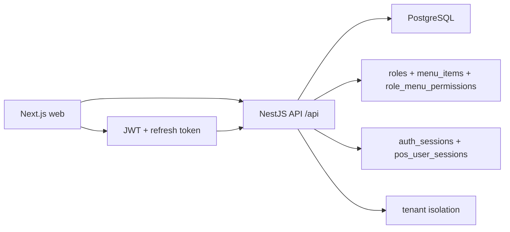

# Manus POS/ERP Multi-tenant

Plataforma SaaS multi-tenant para POS y operaciones ERP ligeras, con frontend en Next.js/React/TypeScript, backend NestJS y PostgreSQL. El estado actual del sistema cubre autenticacion con JWT + refresh tokens + sesiones activas, RBAC dinamico por menu, configuracion por tenant, sucursales, terminales POS, usuarios, roles, catalogos de inventario, compras, pedidos, ventas y flujo de POS con seleccion obligatoria de sucursal/terminal.

## Estado actual

- Frontend: `web/` con App Router de Next.js 14, Redux Toolkit y flujos POS responsive.
- Backend: `api/` con NestJS modular, guards JWT/roles/permisos y acceso PostgreSQL por consultas SQL directas.
- Base de datos: PostgreSQL multi-tenant con esquema versionado parcial en `api/database/`.
- Documentacion: `docs/` reconstruida a partir del codigo fuente actual.

## Stack

| Capa | Tecnologia |
|---|---|
| Frontend | Next.js 14, React 18, TypeScript, Redux Toolkit, Tailwind |
| Backend | NestJS 10, TypeScript, pg, jsonwebtoken, bcryptjs |
| Base de datos | PostgreSQL |
| Auth | JWT de acceso + refresh tokens + `auth_sessions` |
| POS | Sesion POS por usuario + terminal + sucursal |
| Permisos | RBAC por `roles`, `menu_items` y `role_menu_permissions` |

## Arquitectura



## Modulos implementados

- Autenticacion y sesiones
- Tenants y branding
- Sucursales
- Terminales POS
- Usuarios
- Roles
- Menu dinamico y permisos
- Ubicaciones (`paises`, `departamentos`, `municipios`)
- Productos
- Unidades
- Impuestos
- Proveedores
- Clientes
- Compras
- Pedidos
- Ventas
- Ajustes de inventario
- Pantalla POS y carrito

## Modulos no codificados de forma completa

Las siguientes capacidades aparecen como objetivo de negocio, pero no tienen implementacion completa o dedicada en el codigo actual:

- Facturacion electronica
- Caja y cierre diario
- Reportes y analytics
- Dashboard transaccional con KPIs reales
- Devoluciones
- Promociones
- Pagos aplicados a cartera
- E-commerce
- Offline sync
- PWA
- Impresion termica integrada
- Infraestructura Docker o IaC

## Estructura del repositorio

```text
.
|-- api/
|   |-- database/
|   |-- src/
|   |   |-- common/
|   |   `-- modules/
|   `-- ecosystem.config.js
|-- web/
|   |-- app/
|   |-- components/
|   |-- domains/
|   |-- modules/
|   `-- store/
`-- docs/
```

## Instalacion local

### Backend

```bash
cd api
npm install
cp .env.example .env
npm run start:dev
```

Variables base reales documentadas en `api/.env.example`:

```env
PORT=4020
NODE_ENV=production
CORS_ORIGIN=https://yourdomain.com
DB_USERNAME=postgres
DB_PASSWORD=your_secure_password_here
DB_HOST=localhost
DB_PORT=5432
DB_DATABASE=manus_tienda
DB_SSL=false
JWT_SECRET=your_jwt_secret_key_here
JWT_EXPIRES_IN=1h
```

### Frontend

```bash
cd web
npm install
cp .env.example .env
npm run dev
```

Variable base real documentada en `web/.env.example`:

```env
NEXT_PUBLIC_API_BASE_URL=http://localhost:3001/api
```

Nota importante del estado actual:

- `api/.env.example` usa `PORT=4020`.
- `web/.env.example` apunta a `http://localhost:3001/api`.
- Esa diferencia existe hoy en el repositorio y debe alinearse manualmente por ambiente.

## Base de datos

El repositorio incluye SQL versionado para tenants, usuarios, roles, menu, auditoria y sesiones:

- `api/database/initial_schema.sql`
- `api/database/2025_03_07_menu_management.sql`
- `api/database/2025_03_10_auditoria_eventos.sql`
- `api/database/2026_01_31_auth_refresh_tokens.sql`
- `api/database/2026_02_04_auth_sessions.sql`
- `api/database/2026_04_26_seed_menu_role_permissions.sql`

Importante:

- El DDL de inventario, ventas, compras, pedidos, clientes, proveedores, impuestos, unidades, terminales y `pos_user_sessions` no esta versionado como `CREATE TABLE` en `api/database/`.
- Esa parte de la documentacion fue inferida desde entidades, repositorios y consultas activas del backend.

## Migraciones y seeds

No existe un runner de migraciones automatizado en el codigo actual. El repositorio trabaja con scripts SQL manuales bajo `api/database/`.

Seeds detectados:

- tenant inicial `default`
- rol `SUPER_ADMIN`
- permisos base de dashboard/configuracion
- menu dinamico y permisos por rol

## Docker

No se encontraron `Dockerfile`, `docker-compose.yml` ni manifiestos Docker en el repo actual. La documentacion de despliegue cubre el estado real: Vercel para web y backend Linux/PM2 compatible con AWS EC2 o servidores equivalentes.

## Despliegue

- Frontend: `web/vercel.json` indica despliegue tipo Next.js en Vercel.
- Backend: `api/ecosystem.config.js` configura PM2 apuntando a `dist-bin/api`.
- Binario backend: `npm run build:bin` genera ejecutables `dist-bin/`.
- CORS: controlado por `CORS_ORIGIN`.

## Screenshots

- Placeholder: Landing page publica
- Placeholder: Login
- Placeholder: Dashboard tenant
- Placeholder: Configuracion tenant/sucursales
- Placeholder: Usuarios
- Placeholder: Roles
- Placeholder: POS desktop
- Placeholder: POS mobile drawer

## Roadmap resumido

- Facturacion y resoluciones fiscales
- Caja, arqueo y cierre diario
- Reportes y dashboard operativo
- Devoluciones y promociones
- PWA y modo offline
- Integracion con impresoras termicas
- Pagos y cartera
- E-commerce

## Documentacion detallada

La documentacion completa esta en [docs/README.md](docs/README.md).
