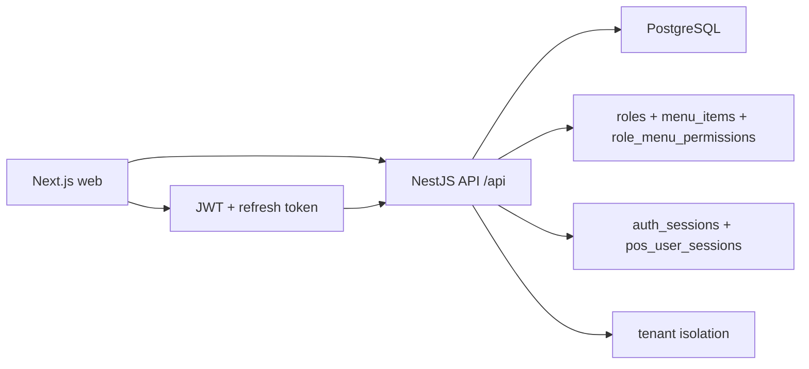

# Manus POS/ERP Multi-tenant

> Línea base documental AS-IS: commit `3dd5098f428e23daf31c750d638c0adb2fa8676a`.
> Ver [índice de arquitectura y trazabilidad](docs/architecture.md).

Plataforma SaaS multi-tenant para POS y operaciones ERP ligeras, con frontend en Next.js/React/TypeScript, backend NestJS y PostgreSQL. El estado actual del sistema cubre autenticacion con JWT + refresh tokens + sesiones activas, RBAC dinamico por menu, configuracion por tenant, sucursales, terminales POS, usuarios, roles, catalogos de inventario, compras, pedidos, ventas y flujo de POS con seleccion obligatoria de sucursal/terminal.

## Estado actual

- Frontend: `web/` con App Router de Next.js 14, Redux Toolkit y flujos POS responsive.
- Backend: `api/` con NestJS modular, guards JWT/roles/permisos y acceso PostgreSQL por consultas SQL directas.
- Base de datos: PostgreSQL multi-tenant con SQL histórico en `api/database/` y un pipeline versionado en `scripts/database/`.
- Documentacion: `docs/` reconstruida a partir del codigo fuente actual.

## Stack

| Capa | Tecnologia |
|---|---|
| Frontend | Next.js 14, React 18, TypeScript, Redux Toolkit, Tailwind |
| Backend | NestJS 10, TypeScript, pg, jsonwebtoken, bcryptjs |
| Base de datos | PostgreSQL |
| Auth | JWT de acceso + refresh tokens + `auth_sessions` |
| POS | Sesion POS por usuario + terminal + sucursal |
| Permisos | RBAC por `roles`, `menu_items` y `role_menu_permissions` |

## Arquitectura


```mermaid
flowchart LR
  Web["Next.js web"] --> API["NestJS API /api"]
  API --> PG["PostgreSQL"]
  Web --> Auth["JWT + refresh token"]
  Auth --> API
  API --> RBAC["roles + menu_items + role_menu_permissions"]
  API --> POS["auth_sessions + pos_user_sessions"]
  API --> Tenant["tenant isolation"]
```

## Modulos implementados

- Autenticacion y sesiones
- Tenants y branding
- Sucursales
- Terminales POS
- Usuarios
- Roles
- Menu dinamico y permisos
- Ubicaciones (`paises`, `departamentos`, `municipios`)
- Productos
- Unidades
- Impuestos
- Proveedores
- Clientes
- Compras
- Pedidos
- Ventas
- Ajustes de inventario
- Pantalla POS y carrito
- Caja, sesiones de caja, movimientos y arqueos
- Métodos de pago, pagos y asignaciones
- Precios, promociones y reportería
- Domicilios, conductores y estados de despacho
- Facturación electrónica como bounded context separado y con integración por outbox
- Peripheral Agent y shell Electron online

## Capacidades parciales o no certificadas

Las siguientes capacidades tienen código, configuración o especificaciones, pero su completitud o despliegue no queda certificado solo con el repositorio:

- Facturación electrónica productiva con DIAN/proveedor real
- Reportes y analytics en infraestructura desplegada
- Dashboard transaccional completo con KPIs de producción
- Devoluciones
- Pagos aplicados a cartera externa
- E-commerce
- Offline sync
- PWA
- Hardware físico y todos los perfiles de impresión
- Firma y distribución productiva de instaladores

## Estructura del repositorio

```text
.
|-- api/
|   |-- database/
|   |-- src/
|   |   |-- common/
|   |   `-- modules/
|   `-- ecosystem.config.js
|-- backend-facturacion-electronica/
|-- backend-perifericos/
|-- backend-reporteria/
|-- desktop/electron/
|-- scripts/database/
|-- web/
|   |-- app/
|   |-- components/
|   |-- domains/
|   |-- modules/
|   `-- store/
`-- docs/
```

## Instalacion local

### Backend

```bash
cd api
npm install
cp .env.example .env
npm run start:dev
```

Variables base reales documentadas en `api/.env.example`:

```env
PORT=4020
NODE_ENV=production
CORS_ORIGIN=https://yourdomain.com
DB_USERNAME=postgres
DB_PASSWORD=your_secure_password_here
DB_HOST=localhost
DB_PORT=5432
DB_DATABASE=manus_tienda
DB_SSL=false
JWT_SECRET=your_jwt_secret_key_here
JWT_EXPIRES_IN=1h
```

### Frontend

```bash
cd web
npm install
cp .env.example .env
npm run dev
```

Variable base real documentada en `web/.env.example`:

```env
NEXT_PUBLIC_API_BASE_URL=http://localhost:3000/api
```

Nota importante del estado actual:

- `api/.env.example` usa `PORT=4020`.
- `web/.env.example` usa `http://localhost:3000/api`, el origen local por defecto de Next.js.
- `web/next.config.mjs` reescribe `/api/*` hacia `API_PROXY_TARGET`, cuyo valor local por defecto es `http://localhost:4020`.
- El puerto `3000` es el puerto del frontend local; el puerto `4020` es el destino local del API.

## Base de datos

El repositorio incluye SQL versionado para tenants, usuarios, roles, menu, auditoria y sesiones:

- `api/database/initial_schema.sql`
- `api/database/2025_03_07_menu_management.sql`
- `api/database/2025_03_10_auditoria_eventos.sql`
- `api/database/2026_01_31_auth_refresh_tokens.sql`
- `api/database/2026_02_04_auth_sessions.sql`
- `api/database/2026_04_26_seed_menu_role_permissions.sql`

Importante:

- `api/database/` conserva SQL histórico y parte del esquema base.
- El pipeline reproducible actual está en `scripts/database/`, con `migrate.sh`, `run_migrations.sh`, `migrate_prd.sh`, `migrations_history` y migraciones versionadas `V046` a `V093`.
- `scripts/database/migrations/V087__report_product_inventory.sql` sí existe en esta rama.
- `database/manus_tienda_qa.sql` es un dump QA. Sirve como evidencia de estado, pero no es el runner de migraciones.

## Migraciones y seeds

El repositorio tiene dos capas históricas de SQL. `scripts/database/migrate_prd.sh` es el flujo que selecciona las migraciones incrementales `*.sql` de `scripts/database/migrations/`. `scripts/database/run_migrations.sh` usa un patrón más restrictivo para archivos `YYYYMMDD_*.sql`. Los archivos bajo `api/database/` se conservan como SQL histórico y compatibilidad documental.

Seeds detectados:

- tenant inicial `default`
- rol `SUPER_ADMIN`
- permisos base de dashboard/configuracion
- menu dinamico y permisos por rol

## Docker

El repositorio contiene `docker-compose.yml` y Dockerfiles para API, reportería y facturación electrónica. El compose es un entorno local declarado; no demuestra por sí solo el despliegue productivo real.

## Despliegue

- Frontend: `web/vercel.json` indica despliegue tipo Next.js en Vercel.
- Backend: `api/ecosystem.config.js` configura PM2 apuntando a `dist-bin/api`.
- Binario backend: `npm run build:bin` genera ejecutables `dist-bin/`.
- CORS: controlado por `CORS_ORIGIN`.

## Screenshots

- Placeholder: Landing page publica
- Placeholder: Login
- Placeholder: Dashboard tenant
- Placeholder: Configuracion tenant/sucursales
- Placeholder: Usuarios
- Placeholder: Roles
- Placeholder: POS desktop
- Placeholder: POS mobile drawer

## Roadmap resumido

- Facturacion y resoluciones fiscales
- Evolución de caja, arqueo y cierre diario
- Evolución de reportes y dashboard operativo
- Devoluciones y promociones
- PWA y modo offline
- Certificación de integración con impresoras térmicas
- Pagos y cartera
- E-commerce

## Documentacion detallada

La documentacion completa esta en [docs/README.md](docs/README.md).
