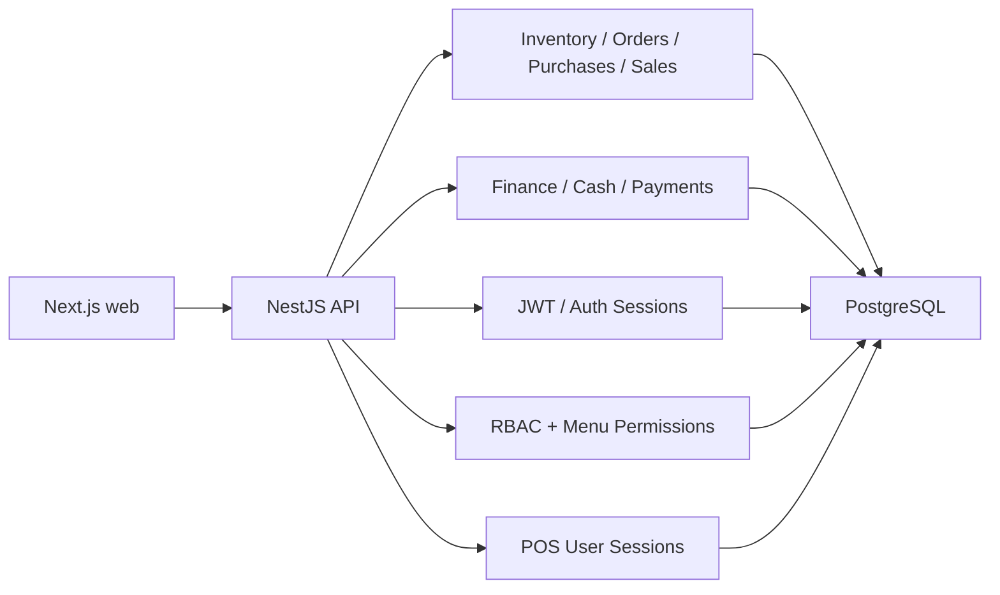

# Arquitectura General

## Resumen

ManusTienda Platform es un SaaS POS/ERP multi-tenant construido sobre:

- Backend: NestJS + PostgreSQL
- Frontend: Next.js App Router + React + Redux Toolkit
- Seguridad: JWT, sesiones activas, RBAC por rol y permisos por menú
- Contexto operativo: tenant, sucursal, terminal, sesión POS y, para finanzas, sesión de caja

La solución separa:

- autenticación y sesiones de usuario
- autorización por rol y permisos
- contexto operativo POS
- módulos de inventario, pedidos, compras, ventas y finanzas

## Topología lógica

## Multi-tenancy

El aislamiento principal ocurre por `tenant_id`.

- `tenants` define cada cliente SaaS.
- Casi todas las tablas operativas relevantes incluyen `tenant_id`.
- El backend resuelve `tenantId` desde JWT y, cuando aplica, desde el contexto operativo inyectado en la request.
- `SUPER_ADMIN` puede operar cruzando tenants.
- El resto de roles queda confinado al tenant autenticado.

## Contexto operativo

### Tenant

Se obtiene desde:

- JWT (`tenant_id`)
- request context enriquecido por middlewares/guards cuando existe una sesión POS

### Sucursal

Se modela con `tenant_branches`.

- `ADMIN` y `USER` operan con alcance restringido por sucursal
- el backend valida acceso por sucursal en servicios como `orders`, `inventory`, `cash sessions`, `cash movements` y `payments`

### Terminal

Se modela con el módulo `terminals` y se usa en:

- selección de contexto POS
- trazabilidad de pedidos, compras, ventas y stock movements

### POS session

Se maneja en `api/src/modules/pos-user-sessions`.

- endpoint: `POST /pos/session`
- endpoint: `GET /pos/session/current`
- se usa para fijar `branchId`, `terminalId` y `posSessionId` en la operación del POS

### Cash session

Se maneja en `api/src/modules/finance/cash-sessions`.

- apertura/cierre de caja
- resumen operativo y arqueo
- referencia para pagos en efectivo y movimientos automáticos/manuales

## Autenticación

El módulo `auth` implementa:

- `POST /auth/login`
- `POST /auth/login/force`
- `POST /auth/refresh`
- `POST /auth/logout`
- `GET /auth/me`
- `GET /auth/menu`
- `GET /auth/context`
- recuperación y reseteo de contraseña

### Flujo actual

1. El usuario inicia sesión con email y contraseña.
2. Se valida estado del usuario y estado del tenant.
3. Se impide sesión concurrente salvo `login/force`.
4. Se crea una fila en `auth_sessions`.
5. Se crea un refresh token hasheado en `auth_refresh_tokens`.
6. Se emite JWT con:
   - `sub`
   - `tenant_id`
   - `roles`
   - `session_id`
7. `GET /auth/me` valida que la sesión siga activa antes de devolver perfil.

## Autorización

Hay dos capas principales.

### 1. Roles

Se aplican con `@Roles(...)` y `RolesGuard`.

Roles base observados:

- `SUPER_ADMIN`
- `SUPER_USER`
- `ADMIN`
- `USER`

### 2. Permisos por menú/acción

Se aplican con `@RequirePermission(...)` y `PermissionsGuard`.

El guard consulta `role_menu_permissions` unido a `menu_items` y resuelve:

- `READ`
- `WRITE`
- acciones específicas almacenadas en `actions` (`jsonb`)

## Alcance por rol

### SUPER_ADMIN

- alcance global total
- puede ver y operar múltiples tenants

### SUPER_USER

- alcance global del tenant actual
- puede operar múltiples sucursales del tenant

### ADMIN

- alcance operativo del tenant con foco por sucursal
- puede gestionar operación diaria y módulos de inventario/finanzas según permisos

### USER

- alcance operativo restringido
- en el estado actual del código ya tiene capacidad ampliada en varios flujos de `orders`, `purchases`, `finance` y POS, pero sigue condicionado por:
  - sucursales asignadas
  - terminal/contexto POS
  - caja abierta propia cuando el flujo lo exige

## Frontend

El frontend usa App Router con rutas dinámicas por tenant:

- `/{tenant}/dashboard`
- `/{tenant}/pos`
- `/{tenant}/orders`
- `/{tenant}/purchases`
- `/{tenant}/inventory`
- `/{tenant}/finance/*`

Piezas relevantes:

- `authSlice`: usuario autenticado
- `menuSlice`: menú por permisos
- `inventoryScopeSlice`: contexto de inventory dashboard
- `posCart`: carrito POS persistido por contexto

## Persistencia del carrito POS

Sí existe persistencia.

Archivo clave: `web/store/posCart.ts`

### Comportamiento actual

- persiste en `localStorage`
- la clave incluye:
  - tenant
  - sucursal
  - terminal
  - usuario
  - `posSessionId`
- si cambia el contexto POS, el estado del carrito se reinicia
- si la venta termina exitosamente, el carrito persistido se limpia

### Ventajas

- evita mezclar carritos entre operadores o terminales
- sobrevive refrescos del navegador

### Riesgos observados

- la persistencia es local al navegador; no hay sincronización servidor-servidor
- no hay recuperación transaccional si otra sesión modifica stock en paralelo
- puede quedar un carrito viejo si se interrumpe el flujo antes de confirmar venta

### Recomendación PRD

- mantener la persistencia local actual como fallback UX
- considerar una futura persistencia server-side de borradores POS para escenarios multi-dispositivo

## Módulos técnicos principales

- `auth`
- `tenants`
- `branches`
- `users`
- `roles`
- `menu`
- `permissions`
- `terminals`
- `pos-user-sessions`
- `inventory`
- `finance`

## Observaciones PRD

- La arquitectura ya soporta operación multi-tenant y multi-sucursal real.
- El módulo de finanzas extiende el dominio con sesiones de caja, movimientos y pagos.
- El contexto POS y el contexto de caja están separados, lo cual es correcto para producción.
- Conviene centralizar todavía más la documentación de cambios SQL en `/scripts/database` y exigir orden estricto de ejecución por ambiente.
