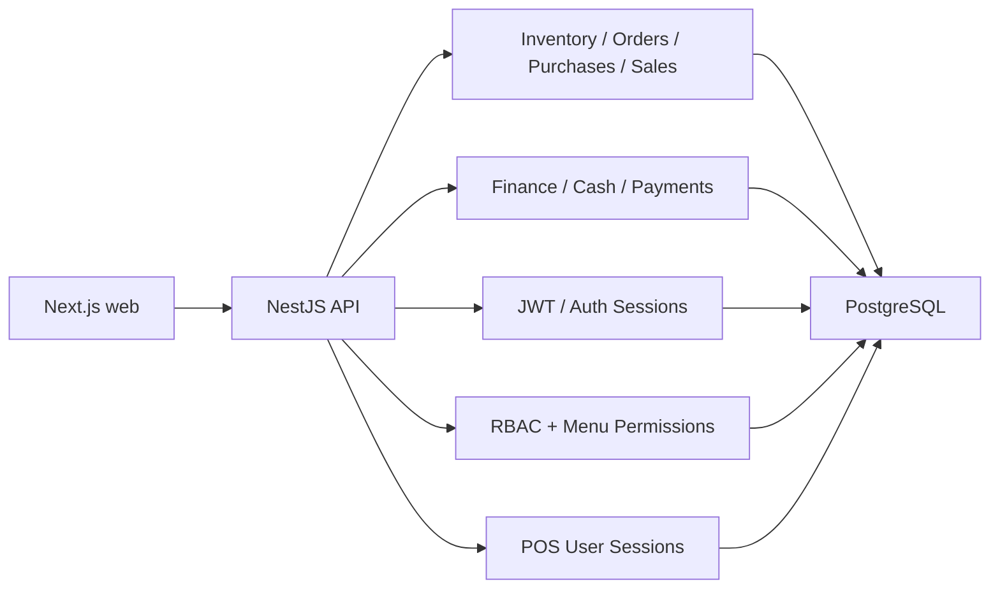

# Arquitectura General

## Índice de la línea base AS-IS

Esta documentación se reconstruye desde el commit `3dd5098f428e23daf31c750d638c0adb2fa8676a`.
La etiqueta **confirmado** significa evidencia en código, configuración o SQL versionado.
La etiqueta **declarado** significa configuración o documentación que aún requiere validación de despliegue.
La etiqueta **pendiente** significa que falta prueba funcional, infraestructura o hardware.

- [Línea base y ficha del commit](architecture/as-is-baseline.md)
- [Inventario de componentes](architecture/component-inventory.md)
- [Relaciones y contratos entre servicios](architecture/service-contracts.md)
- [Diagramas Mermaid y fuentes](architecture/diagrams.md)
- [Modelo de datos y migraciones](database/overview.md)
- [Arquitectura interna de la API](api/architecture-as-is.md)
- [Persistencia PostgreSQL AS-IS](database/persistence-as-is.md)
- [Backend Reportería AS-IS](architecture/backend-reporteria-as-is.md)
- [Backend Facturación Electrónica AS-IS](architecture/electronic-billing-as-is.md)
- [Integration Outbox AS-IS](architecture/integration-outbox-as-is.md)
- [Matriz de contratos B2.3](architecture/service-contract-matrix-b23.md)
- [Matriz de eventos y estados B2.3](architecture/event-state-matrix-b23.md)
- [Arquitectura operativa AS-IS](architecture/operations-as-is.md)
- [Matriz de configuración por ambiente](architecture/environment-configuration-matrix.md)
- [Observabilidad y recuperación AS-IS](architecture/observability-recovery-as-is.md)
- [Matriz de evidencia QA](architecture/qa-evidence-matrix.md)
- [Arquitectura Web AS-IS](architecture/web-as-is.md)
- [Inventario de modulos Web](architecture/web-module-inventory.md)
- [Matriz de contratos frontend-backend](architecture/frontend-contract-matrix.md)
- [Autenticación](architecture/authentication.md)
- [Multi-tenancy](architecture/multi-tenancy.md)
- [POS](architecture/pos-flow.md)
- [Motor transaccional POS AS-IS B4.1](architecture/pos-transaction-as-is.md)
- [Contratos transaccionales POS B4.1](architecture/pos-transaction-contract-matrix.md)
- [Límites transaccionales POS B4.1](architecture/pos-transaction-boundary-matrix.md)
- [Fallos y recuperación de ventas POS B4.1](architecture/pos-transaction-failure-matrix.md)
- [Evidencias del motor transaccional POS B4.1](architecture/pos-transaction-evidence-matrix.md)
- [Compras, pedidos y ventas operativas AS-IS B5.3.1](architecture/purchases-orders-operational-sales-as-is-b531.md)
- [Contratos de compras, pedidos y ventas operativas B5.3.1](architecture/purchases-orders-operational-sales-contract-matrix-b531.md)
- [Estados y límites transaccionales B5.3.1](architecture/purchases-orders-operational-sales-state-transaction-matrix-b531.md)
- [Evidencias de compras, pedidos y ventas operativas B5.3.1](architecture/purchases-orders-operational-sales-evidence-matrix-b531.md)
- [Caja, pagos y domicilios AS-IS B5.3.2](architecture/cash-payments-deliveries-as-is-b532.md)
- [Contratos de caja, pagos y domicilios B5.3.2](architecture/cash-payments-deliveries-contract-matrix-b532.md)
- [Estados y límites transaccionales de caja, pagos y domicilios B5.3.2](architecture/cash-payments-deliveries-state-transaction-matrix-b532.md)
- [Fallos y recuperación de caja, pagos y domicilios B5.3.2](architecture/cash-payments-deliveries-failure-recovery-b532.md)
- [Evidencias de caja, pagos y domicilios B5.3.2](architecture/cash-payments-deliveries-evidence-matrix-b532.md)
- [Productos, inventario, precios, impuestos y promociones AS-IS B5.3.3](architecture/products-inventory-pricing-as-is-b533.md)
- [Contratos de productos, inventario y pricing B5.3.3](architecture/products-inventory-pricing-contract-matrix-b533.md)
- [Estados y transacciones de productos e inventario B5.3.3](architecture/products-inventory-pricing-state-transaction-matrix-b533.md)
- [Fallos y recuperación de productos e inventario B5.3.3](architecture/products-inventory-pricing-failure-recovery-b533.md)
- [Evidencias de productos, inventario y pricing B5.3.3](architecture/products-inventory-pricing-evidence-matrix-b533.md)
- [Frontend POS AS-IS B4.2](architecture/pos-frontend-as-is.md)
- [Inventario de componentes frontend POS B4.2](architecture/pos-frontend-component-inventory.md)
- [Contratos Web-API POS B4.2](architecture/pos-frontend-contract-matrix-b42.md)
- [Estados y errores frontend POS B4.2](architecture/pos-frontend-state-error-matrix-b42.md)
- [Evidencias frontend POS B4.2](architecture/pos-frontend-evidence-matrix-b42.md)
- [Electron y Peripheral Agent AS-IS B4.3](architecture/electron-peripherals-as-is-b43.md)
- [Inventario de dispositivos y adaptadores B4.3](architecture/peripheral-device-inventory-b43.md)
- [Contratos IPC y HTTP locales B4.3](architecture/peripheral-contract-matrix-b43.md)
- [Fallos y recuperación de periféricos B4.3](architecture/peripheral-failure-recovery-b43.md)
- [Evidencia QA de periféricos B4.3](architecture/peripheral-qa-evidence-b43.md)
- [Inventario](architecture/inventory-flow.md)
- [Electron y periféricos](architecture/electron-online-windows-implementation.md)

La URL heredada `https://portal.emaus.centrivosoft.com/login` aparece como fallback/configuración de Electron.
Su vigencia operativa no se certifica en esta fase y no se modifica desde documentación.

## Resumen

ManusTienda Platform es un SaaS POS/ERP multi-tenant construido sobre:

- Backend: NestJS + PostgreSQL
- Frontend: Next.js App Router + React + Redux Toolkit
- Seguridad: JWT, sesiones activas, RBAC por rol y permisos por menú
- Contexto operativo: tenant, sucursal, terminal, sesión POS y, para finanzas, sesión de caja

La solución separa:

- autenticación y sesiones de usuario
- autorización por rol y permisos
- contexto operativo POS
- módulos de inventario, pedidos, compras, ventas y finanzas

## Topología lógica

```mermaid
flowchart LR
  A["Next.js web"] --> B["NestJS API"]
  B --> C["JWT / Auth Sessions"]
  B --> D["RBAC + Menu Permissions"]
  B --> E["POS User Sessions"]
  B --> F["Inventory / Orders / Purchases / Sales"]
  B --> G["Finance / Cash / Payments"]
  F --> H["PostgreSQL"]
  G --> H
  C --> H
  D --> H
  E --> H
```

## Multi-tenancy

El aislamiento principal ocurre por `tenant_id`.

- `tenants` define cada cliente SaaS.
- Casi todas las tablas operativas relevantes incluyen `tenant_id`.
- El backend resuelve `tenantId` desde JWT y, cuando aplica, desde el contexto operativo inyectado en la request.
- `SUPER_ADMIN` puede operar cruzando tenants.
- El resto de roles queda confinado al tenant autenticado.

## Contexto operativo

### Tenant

Se obtiene desde:

- JWT (`tenant_id`)
- request context enriquecido por middlewares/guards cuando existe una sesión POS

### Sucursal

Se modela con `tenant_branches`.

- `ADMIN` y `USER` operan con alcance restringido por sucursal
- el backend valida acceso por sucursal en servicios como `orders`, `inventory`, `cash sessions`, `cash movements` y `payments`

### Terminal

Se modela con el módulo `terminals` y se usa en:

- selección de contexto POS
- trazabilidad de pedidos, compras, ventas y stock movements

### POS session

Se maneja en `api/src/modules/pos-user-sessions`.

- endpoint: `POST /pos/session`
- endpoint: `GET /pos/session/current`
- se usa para fijar `branchId`, `terminalId` y `posSessionId` en la operación del POS

### Cash session

Se maneja en `api/src/modules/finance/cash-sessions`.

- apertura/cierre de caja
- resumen operativo y arqueo
- referencia para pagos en efectivo y movimientos automáticos/manuales

## Autenticación

El módulo `auth` implementa:

- `POST /auth/login`
- `POST /auth/login/replace-session`
- `POST /auth/refresh`
- `POST /auth/logout`
- `GET /auth/me`
- `GET /auth/menu`
- `GET /auth/context`
- recuperación y reseteo de contraseña

### Flujo actual

1. El usuario inicia sesión con email y contraseña.
2. Se valida estado del usuario y estado del tenant.
3. Se impide sesión concurrente; una sesión activa solo se reemplaza mediante
   `login/replace-session` después de validar nuevamente la contraseña.
4. Se crea una fila en `auth_sessions`.
5. Se crea un refresh token hasheado en `auth_refresh_tokens`.
6. Se emite JWT con:
   - `sub`
   - `tenant_id`
   - `roles`
   - `session_id`
7. `GET /auth/me` valida que la sesión siga activa antes de devolver perfil.

## Autorización

Hay dos capas principales.

### 1. Roles

Se aplican con `@Roles(...)` y `RolesGuard`.

Roles base observados:

- `SUPER_ADMIN`
- `SUPER_USER`
- `ADMIN`
- `USER`

### 2. Permisos por menú/acción

Se aplican con `@RequirePermission(...)` y `PermissionsGuard`.

El guard consulta `role_menu_permissions` unido a `menu_items` y resuelve:

- `READ`
- `WRITE`
- acciones específicas almacenadas en `actions` (`jsonb`)

## Alcance por rol

### SUPER_ADMIN

- alcance global total
- puede ver y operar múltiples tenants

### SUPER_USER

- alcance global del tenant actual
- puede operar múltiples sucursales del tenant

### ADMIN

- alcance operativo del tenant con foco por sucursal
- puede gestionar operación diaria y módulos de inventario/finanzas según permisos

### USER

- alcance operativo restringido
- en el estado actual del código ya tiene capacidad ampliada en varios flujos de `orders`, `purchases`, `finance` y POS, pero sigue condicionado por:
  - sucursales asignadas
  - terminal/contexto POS
  - caja abierta propia cuando el flujo lo exige

## Frontend

El frontend usa App Router con rutas dinámicas por tenant:

- `/{tenant}/dashboard`
- `/{tenant}/pos`
- `/{tenant}/orders`
- `/{tenant}/purchases`
- `/{tenant}/inventory`
- `/{tenant}/finance/*`

Piezas relevantes:

- `authSlice`: usuario autenticado
- `menuSlice`: menú por permisos
- `inventoryScopeSlice`: contexto de inventory dashboard
- `posCart`: carrito POS persistido por contexto

## Persistencia del carrito POS

Sí existe persistencia.

Archivo clave: `web/store/posCart.ts`

### Comportamiento actual

- persiste en `localStorage`
- la clave incluye:
  - tenant
  - sucursal
  - terminal
  - usuario
  - `posSessionId`
- si cambia el contexto POS, el estado del carrito se reinicia
- si la venta termina exitosamente, el carrito persistido se limpia

### Ventajas

- evita mezclar carritos entre operadores o terminales
- sobrevive refrescos del navegador

### Riesgos observados

- la persistencia es local al navegador; no hay sincronización servidor-servidor
- no hay recuperación transaccional si otra sesión modifica stock en paralelo
- puede quedar un carrito viejo si se interrumpe el flujo antes de confirmar venta

### Recomendación PRD

- mantener la persistencia local actual como fallback UX
- considerar una futura persistencia server-side de borradores POS para escenarios multi-dispositivo

## Módulos técnicos principales

- `auth`
- `tenants`
- `branches`
- `users`
- `roles`
- `menu`
- `permissions`
- `terminals`
- `pos-user-sessions`
- `inventory`
- `finance`

## Observaciones PRD

- La arquitectura ya soporta operación multi-tenant y multi-sucursal real.
- El módulo de finanzas extiende el dominio con sesiones de caja, movimientos y pagos.
- El contexto POS y el contexto de caja están separados, lo cual es correcto para producción.
- Conviene centralizar todavía más la documentación de cambios SQL en `/scripts/database` y exigir orden estricto de ejecución por ambiente.
