# Diagramas de arquitectura AS-IS

Estos diagramas son vistas documentales. Las relaciones **confirmadas** tienen evidencia de código. Las relaciones **declaradas** provienen de configuración. Las relaciones **pendientes** requieren despliegue, base o hardware externo.

## Contexto

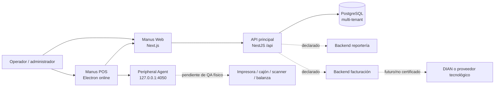

Fuentes: `web/`, `api/src/main.ts`, `docker-compose.yml`, `desktop/electron/agent-client.ts`, `backend-perifericos/src/main.ts`, `backend-facturacion-electronica/README.md`.

## Componentes internos de la API

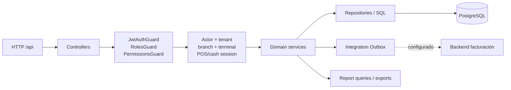

Confirmado por `app.module.ts`, `access-control.module.ts`, `jwt-auth.guard.ts`, controladores y servicios. La frontera exacta de reportería como llamada HTTP desde API no se certifica para cada flujo; parte de reportería consulta PostgreSQL directamente.

## Secuencia de autenticación y sesión

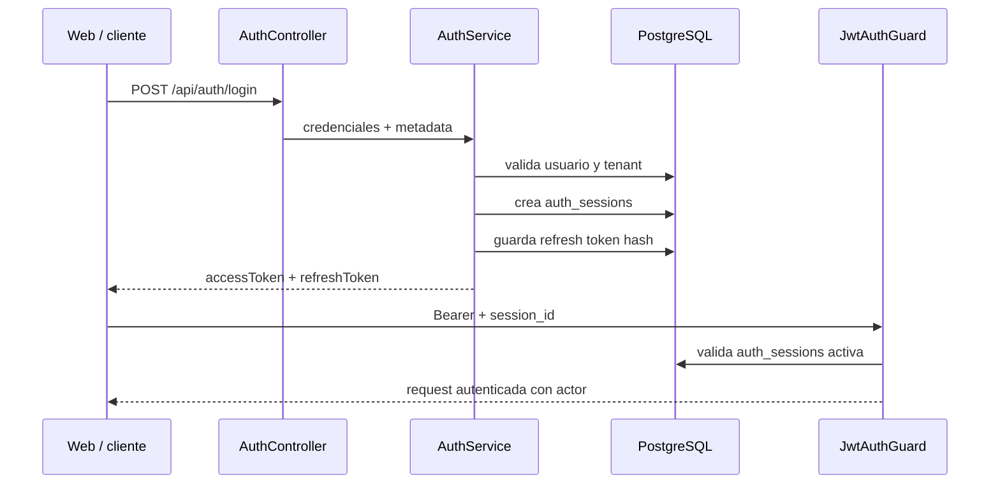

Fuentes: `api/src/modules/auth/auth.controller.ts:46-97`, `api/src/modules/auth/auth.service.ts`, `api/src/common/guards/jwt-auth.guard.ts:58-100`.

## Persistencia de una operación transaccional

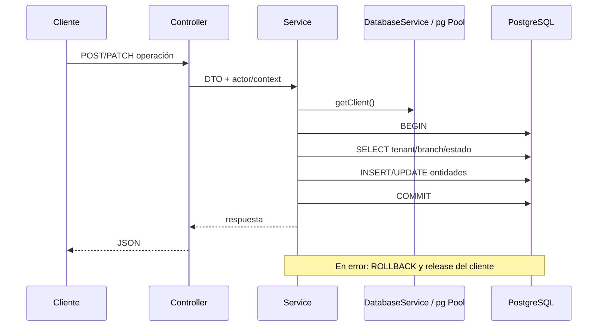

Confirmado en servicios de auth, usuarios, sucursales, terminales, POS, finanzas, productos, promociones y dispositivos. No significa que todas las operaciones de todos los módulos usen la misma transacción.

## Modelo entidad-relación por dominios

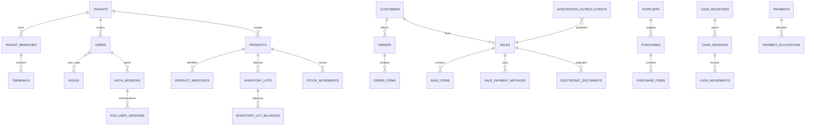

La vista es conceptual y por dominios. Las cardinalidades y constraints exactas deben validarse contra cada migración y no solo contra el dump QA.

## Contenedores

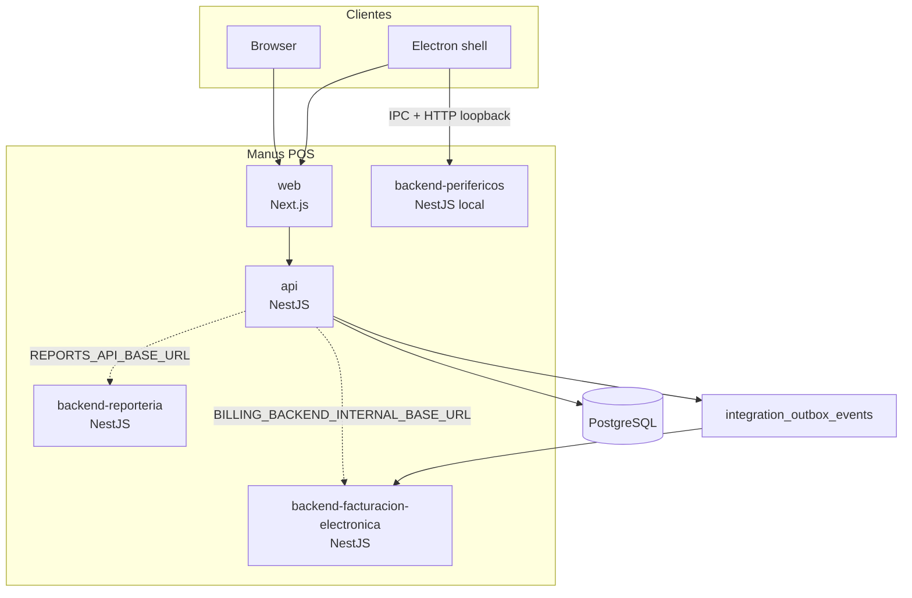

El compose local declara `api`, `reporteria` y `facturacion`; no declara Web, Electron ni Agent como servicios Docker. Estos últimos corren en el host según el comentario de `docker-compose.yml`.

## Secuencia Electron → Peripheral Agent

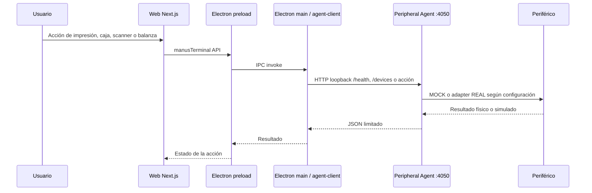

Confirmado: IPC, cliente HTTP loopback y endpoints del Agent.
Pendiente: operación física real y certificación por modelo/driver.

## No representado como AS-IS

No se dibuja operación offline, sincronización local, DIAN productivo, auto-update, firma de instaladores ni hardware certificado general. Esas capacidades aparecen como futuro, mock, feature flag o pendiente en la documentación y el código.

## B2.3: componentes de reportería

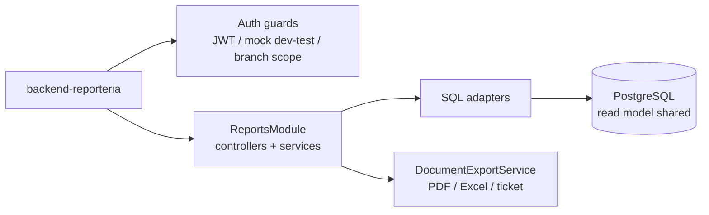

Confirmado: NestJS, guards, SQL directo y exportación. Pendiente: despliegue real, conexión efectiva y contrato HTTP con la API principal.

## B2.3: componentes de facturación electrónica

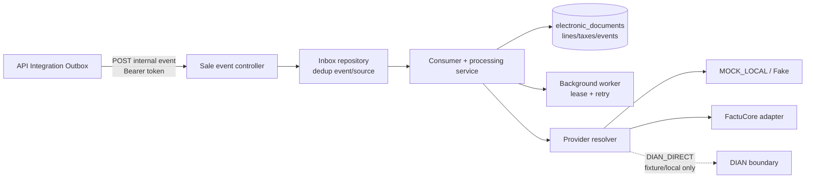

La línea punteada no certifica transmisión DIAN. La configuración declara llamadas externas deshabilitadas por defecto.

## B2.3: ciclo del Integration Outbox

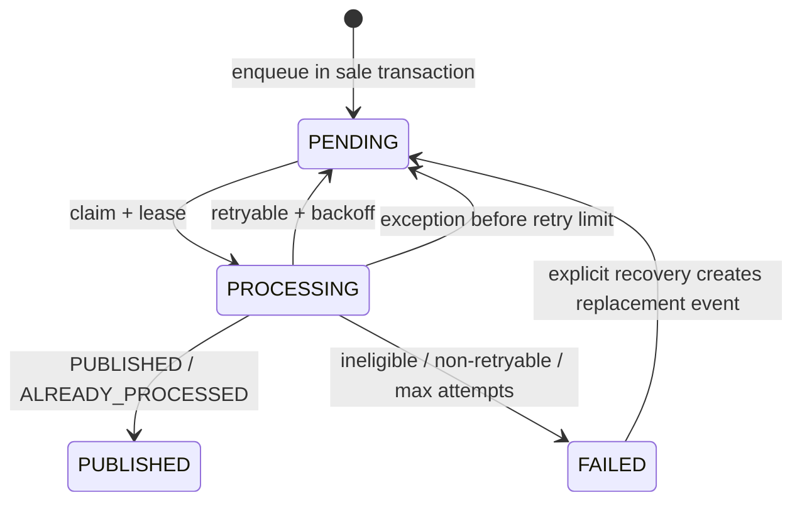

`PENDING` y `FAILED` son estados del outbox observados en código. El receptor tiene su propio inbox y estados de documento; no son la misma máquina de estados.

## B2.3: venta hacia procesamiento fiscal

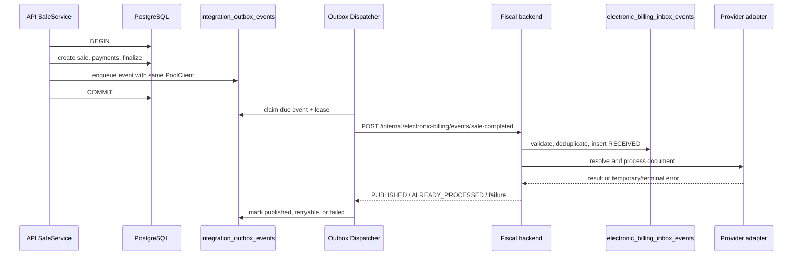

Confirmado: transacción de venta/outbox y contrato interno. Pendiente: recorrido real entre procesos, proveedor y ambiente; no se dibuja aceptación DIAN.

## B2.4: despliegue operativo declarado

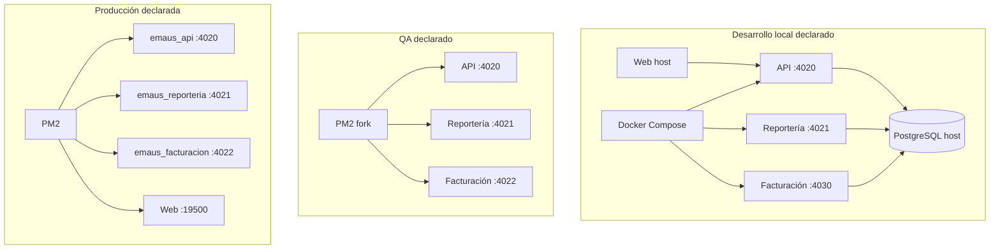

Local está respaldado por `docker-compose.yml`. QA y producción están respaldados por workflows/scripts. Ningún bloque representa una consulta al ambiente real.

## B2.4: señales y recuperación

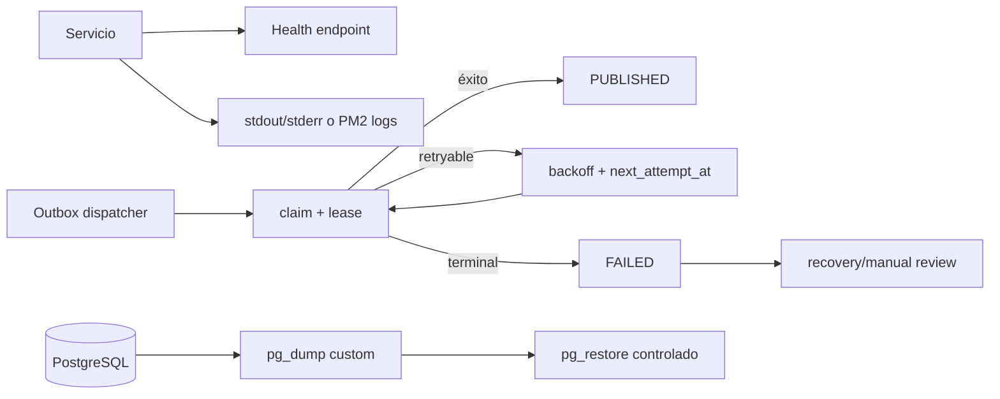

Confirmado en código/scripts: health básico, logs de proceso, lease/backoff y backup/restore declarados. Pendiente: alertas, métricas, trazas, restore probado y RPO/RTO.
## B3: arquitectura interna Web

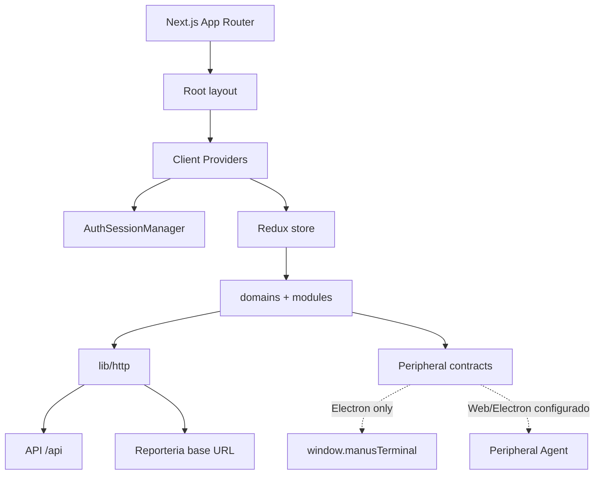

Confirmado por `web/app/providers.tsx`, `web/lib/http.ts`, reporteria y
`web/domains/peripherals/`. Disponibilidad de destinos y hardware quedan sin
verificar.

## B3: autenticacion y refresh

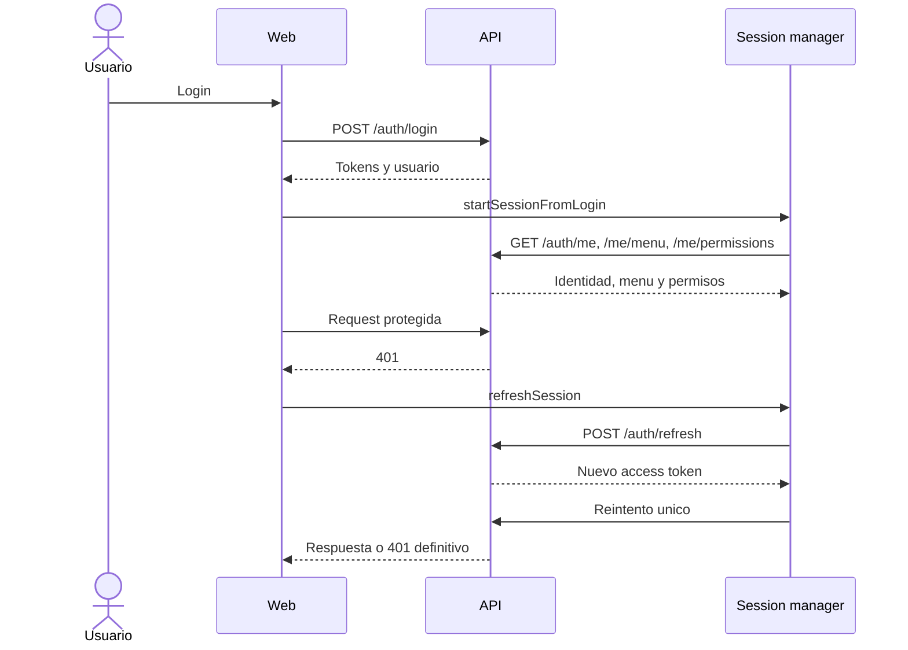

Confirmado en `web/domains/auth/session-manager.ts` y `web/lib/http.ts`.

## B3: consumo de servicios

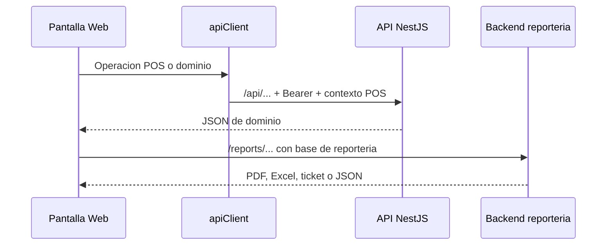

Web -> API y Web -> reporteria estan confirmados por clientes distintos.

## B3: Web, Electron y Agent

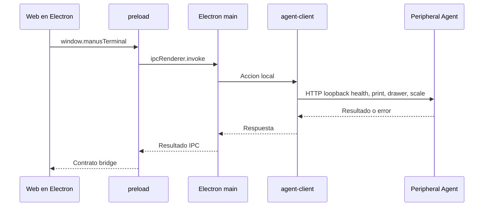

Confirmado por `desktop/electron/preload.ts`, `main.ts` y `agent-client.ts`.
En Web convencional, Agent depende de URLs configuradas y no demuestra acceso
al bridge Electron. No se representa hardware certificado, offline ni
auto-update.
