# Diagramas de arquitectura AS-IS

Estos diagramas son vistas documentales. Las relaciones **confirmadas** tienen evidencia de código. Las relaciones **declaradas** provienen de configuración. Las relaciones **pendientes** requieren despliegue, base o hardware externo.

## Contexto

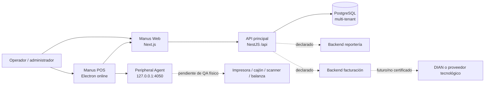

Fuentes: `web/`, `api/src/main.ts`, `docker-compose.yml`, `desktop/electron/agent-client.ts`, `backend-perifericos/src/main.ts`, `backend-facturacion-electronica/README.md`.

## Componentes internos de la API

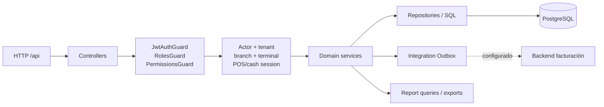

Confirmado por `app.module.ts`, `access-control.module.ts`, `jwt-auth.guard.ts`, controladores y servicios. La frontera exacta de reportería como llamada HTTP desde API no se certifica para cada flujo; parte de reportería consulta PostgreSQL directamente.

## Secuencia de autenticación y sesión

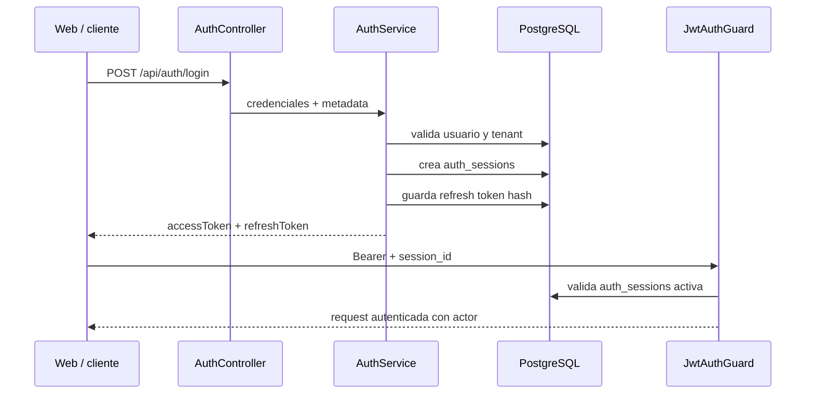

Fuentes: `api/src/modules/auth/auth.controller.ts:46-97`, `api/src/modules/auth/auth.service.ts`, `api/src/common/guards/jwt-auth.guard.ts:58-100`.

## Persistencia de una operación transaccional

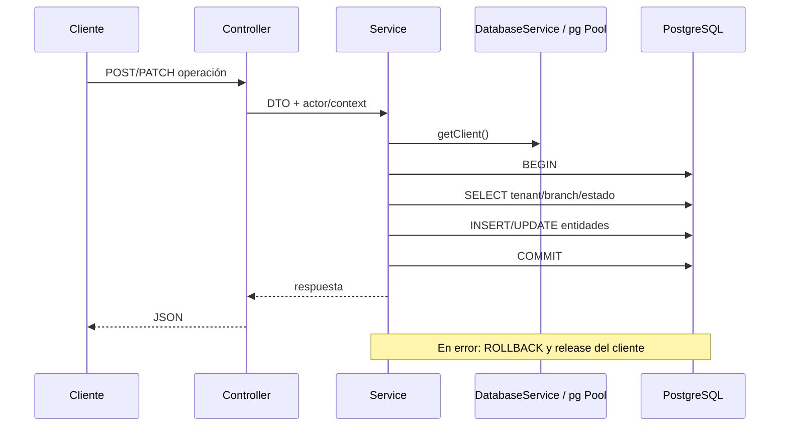

Confirmado en servicios de auth, usuarios, sucursales, terminales, POS, finanzas, productos, promociones y dispositivos. No significa que todas las operaciones de todos los módulos usen la misma transacción.

## Modelo entidad-relación por dominios

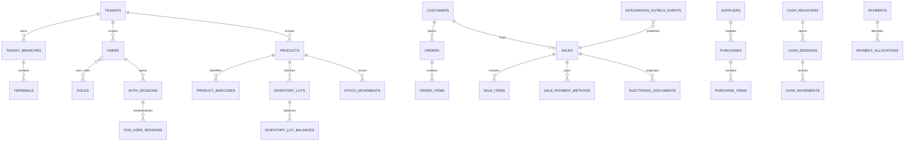

La vista es conceptual y por dominios. Las cardinalidades y constraints exactas deben validarse contra cada migración y no solo contra el dump QA.

## Contenedores

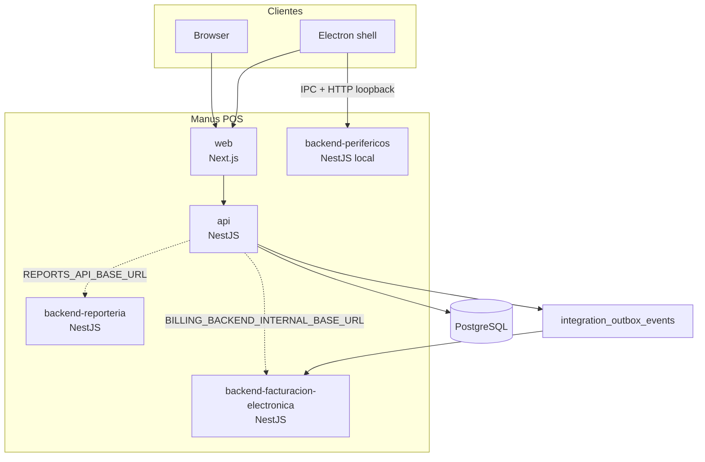

El compose local declara `api`, `reporteria` y `facturacion`; no declara Web, Electron ni Agent como servicios Docker. Estos últimos corren en el host según el comentario de `docker-compose.yml`.

## Secuencia Electron → Peripheral Agent

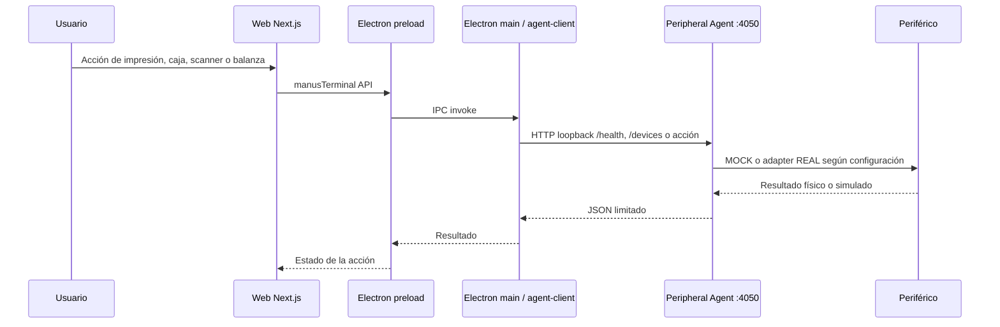

Confirmado: IPC, cliente HTTP loopback y endpoints del Agent.
Pendiente: operación física real y certificación por modelo/driver.

## No representado como AS-IS

No se dibuja operación offline, sincronización local, DIAN productivo, auto-update, firma de instaladores ni hardware certificado general. Esas capacidades aparecen como futuro, mock, feature flag o pendiente en la documentación y el código.

## B2.3: componentes de reportería

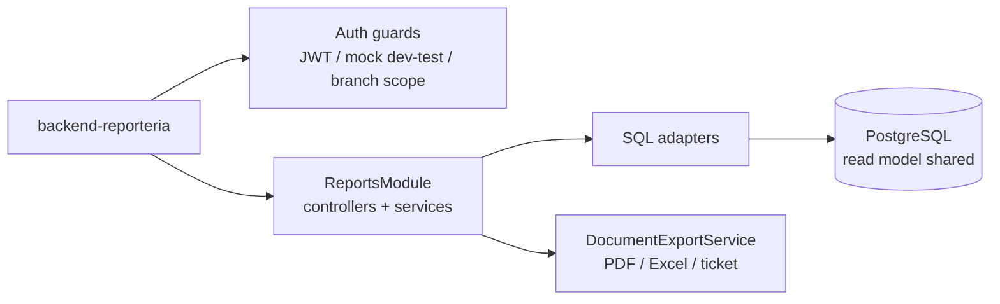

Confirmado: NestJS, guards, SQL directo y exportación. Pendiente: despliegue real, conexión efectiva y contrato HTTP con la API principal.

## B2.3: componentes de facturación electrónica

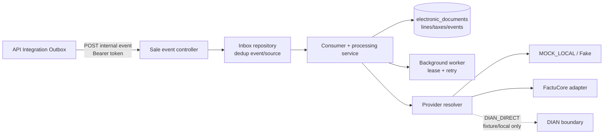

La línea punteada no certifica transmisión DIAN. La configuración declara llamadas externas deshabilitadas por defecto.

## B2.3: ciclo del Integration Outbox

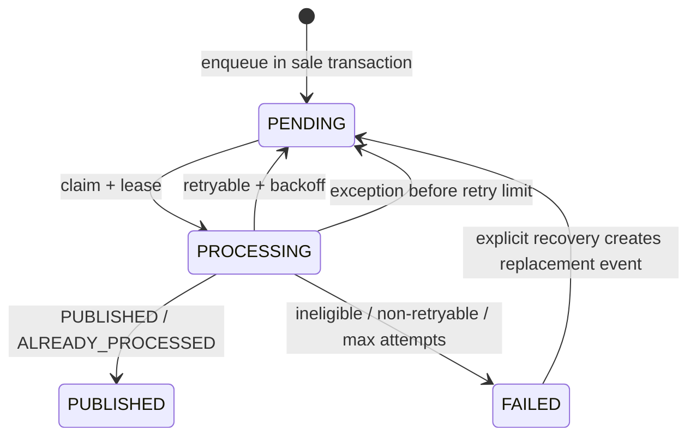

`PENDING` y `FAILED` son estados del outbox observados en código. El receptor tiene su propio inbox y estados de documento; no son la misma máquina de estados.

## B2.3: venta hacia procesamiento fiscal

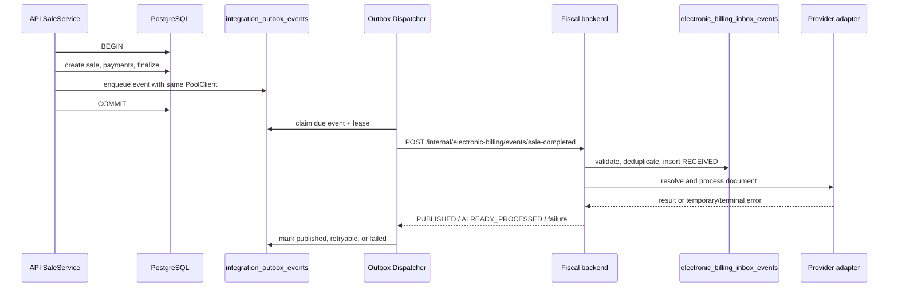

Confirmado: transacción de venta/outbox y contrato interno. Pendiente: recorrido real entre procesos, proveedor y ambiente; no se dibuja aceptación DIAN.

## B2.4: despliegue operativo declarado

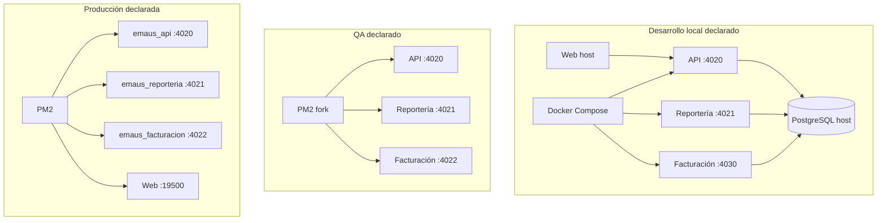

Local está respaldado por `docker-compose.yml`. QA y producción están respaldados por workflows/scripts. Ningún bloque representa una consulta al ambiente real.

## B2.4: señales y recuperación

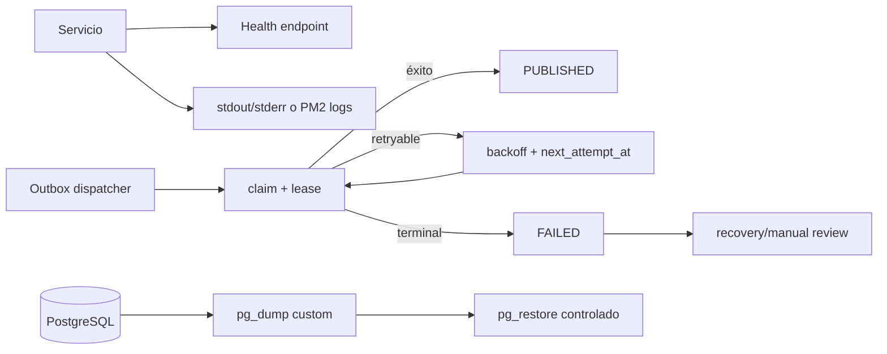

Confirmado en código/scripts: health básico, logs de proceso, lease/backoff y backup/restore declarados. Pendiente: alertas, métricas, trazas, restore probado y RPO/RTO.
## B3: arquitectura interna Web

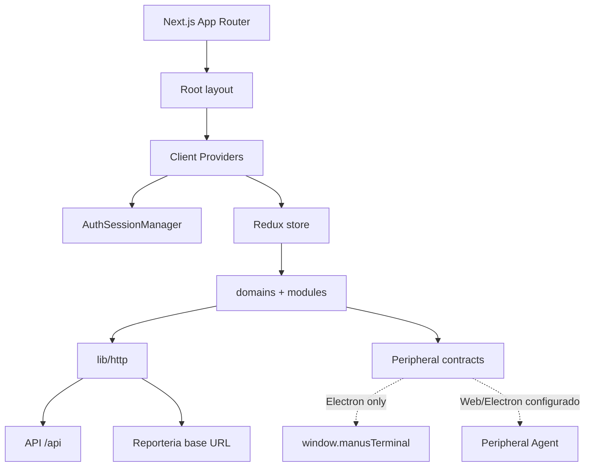

Confirmado por `web/app/providers.tsx`, `web/lib/http.ts`, reporteria y
`web/domains/peripherals/`. Disponibilidad de destinos y hardware quedan sin
verificar.

## B3: autenticacion y refresh

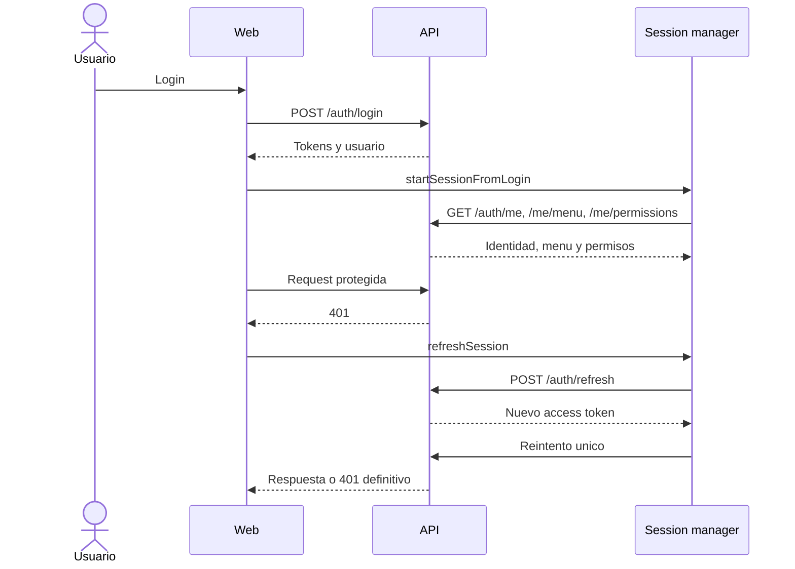

Confirmado en `web/domains/auth/session-manager.ts` y `web/lib/http.ts`.

## B3: consumo de servicios

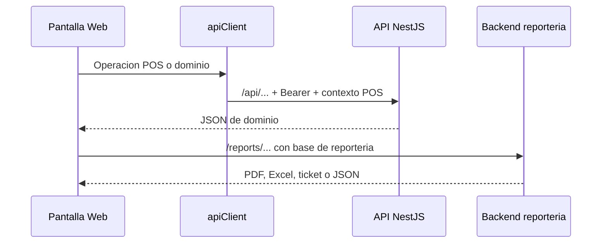

Web -> API y Web -> reporteria estan confirmados por clientes distintos.

## B3: Web, Electron y Agent

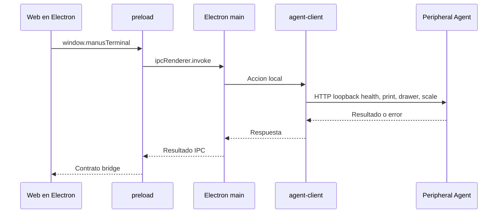

Confirmado por `desktop/electron/preload.ts`, `main.ts` y `agent-client.ts`.
En Web convencional, Agent depende de URLs configuradas y no demuestra acceso
al bridge Electron. No se representa hardware certificado, offline ni
auto-update.

## B4.1: componentes transaccionales POS

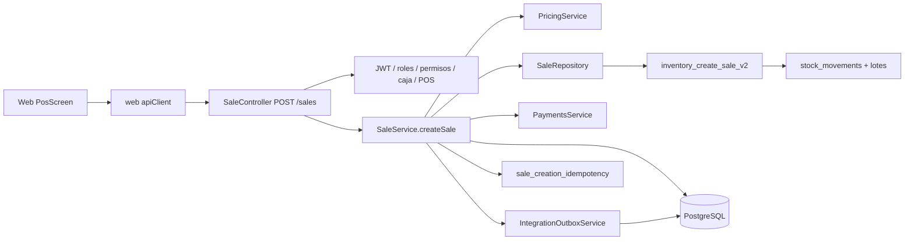

Relaciones confirmadas por `web/modules/pos/services/pos.service.ts`,
`api/src/modules/inventory/controllers/sale.controller.ts`,
`api/src/modules/inventory/services/sale.service.ts` y el SQL de
`inventory_create_sale_v2`. El consumidor fiscal y su despacho se describen
en [Integration Outbox AS-IS](integration-outbox-as-is.md). No se afirma aquí
entrega exactamente una vez ni despliegue fiscal productivo.

## B4.1: venta POS exitosa y frontera de commit

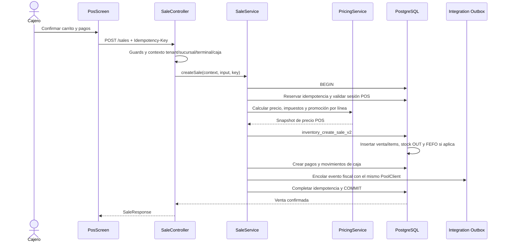

La secuencia representa la ruta directa confirmada. La ejecución real depende
del esquema instalado en el ambiente; QA, producción y proveedor fiscal no se
certifican desde este repositorio.

## B4.1: rechazo y rollback

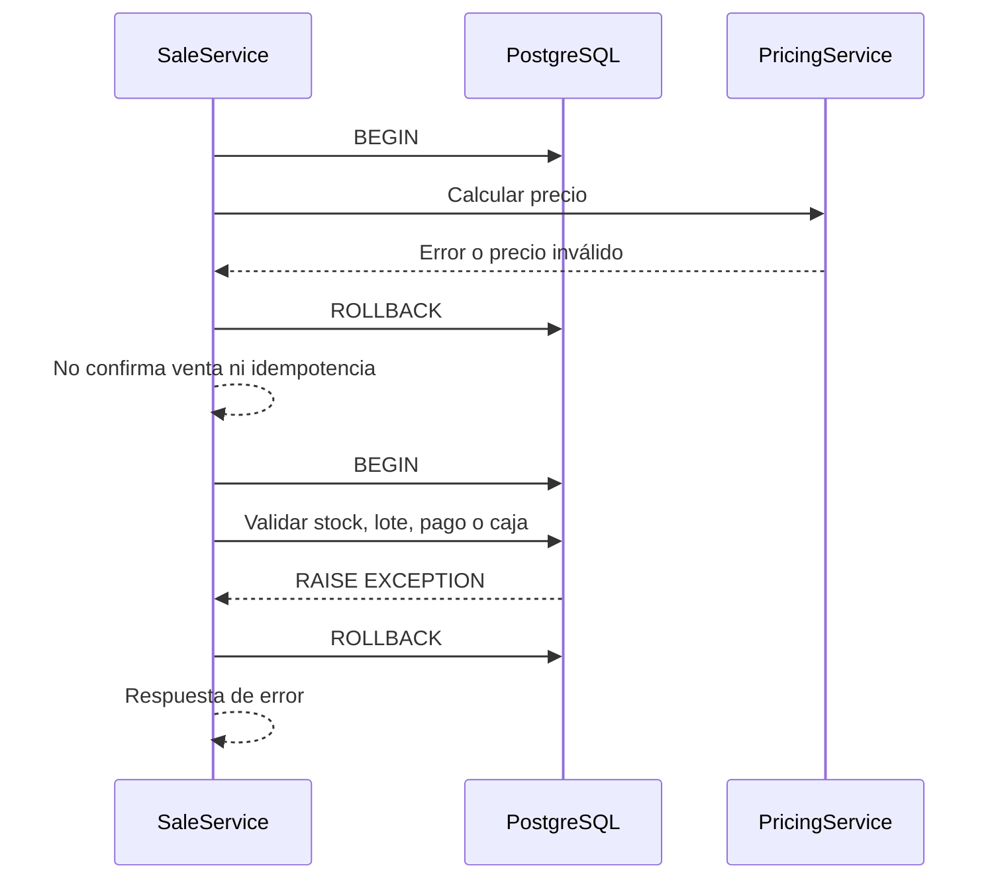

El `catch` de `createSale` hace rollback y libera el `PoolClient`. Las
respuestas HTTP concretas dependen de la excepción NestJS. No se documenta
recuperación automática posterior al commit.

## B4.1: cancelación y compensación

```mermaid
sequenceDiagram
  participant API as POST /sales/:id/cancel
  participant S as SaleService
  participant DB as PostgreSQL
  participant Pay as PaymentsRepository
  API->>S: cancelSale(id, context)
  S->>DB: BEGIN
  S->>DB: SELECT venta FOR UPDATE
  S->>DB: Crear movimientos IN compensatorios
  S->>DB: Revertir lotes y cantidades de pedido
  S->>Pay: Crear refund y movimiento de caja si aplica
  S->>DB: Estado CANCELLED o REFUNDED
  S->>DB: COMMIT
  S-->>API: Venta cancelada
```

La compensación y sus condiciones están implementadas en
`api/src/modules/inventory/services/sale.service.ts`. Una devolución
independiente distinta de `cancelSale` no fue identificada en esta revisión.

## B4.2: arquitectura interna del frontend POS

```mermaid
flowchart TB
  Route["app/[tenant]/pos/page.tsx"] --> Screen["PosScreen"]
  Screen --> Context["usePosContext + pos slice"]
  Screen --> Cart["usePosCartStore + posCart slice"]
  Screen --> Catalog["productos, clientes, impuestos"]
  Screen --> Pricing["previewPosLinePrice"]
  Screen --> Payment["PaymentDialog"]
  Screen --> Scanner["scanner wedge / peripherals contracts"]
  Screen --> Sale["createSale / reconcileSale"]
  Sale --> HTTP["apiClient"]
  HTTP --> API["NestJS API"]
  Screen --> Print["runSalePeripheralOperations"]
  Print -. "post-commit" .-> Agent["Electron bridge / Peripheral Agent"]
```

La ruta, estado y clientes están confirmados en Web. La disponibilidad del
bridge y del Agent depende del entorno; no se presenta como requisito de venta.

## B4.2: ciclo de vida del carrito

```mermaid
stateDiagram-v2
  [*] --> DRAFT
  DRAFT --> DRAFT: agregar, quitar o cambiar cantidad
  DRAFT --> PRICING_PENDING: cambio de producto, cantidad, sucursal o cliente
  PRICING_PENDING --> DRAFT: preview de precio OK
  PRICING_PENDING --> PRICING_ERROR: error no recuperable
  PRICING_PENDING --> PRICING_PENDING: sin red o backend pendiente
  PRICING_ERROR --> PRICING_PENDING: reintento online
  DRAFT --> SUBMITTING: submitSale
  SUBMITTING --> CONFIRMED: respuesta 2xx
  SUBMITTING --> DRAFT: rechazo HTTP 4xx
  SUBMITTING --> UNKNOWN: timeout, red o error no definitivo
  UNKNOWN --> CONFIRMED: reconcileSale encuentra venta
  UNKNOWN --> UNKNOWN: reconciliación 404/409/error
  CONFIRMED --> DRAFT: limpiar venta y comenzar otra
```

`PRICING_PENDING` y `PRICING_ERROR` son estados de línea; `SUBMITTING`,
`UNKNOWN` y `CONFIRMED` son estados de la venta en el store del carrito.

## B4.2: cobro Web-API

```mermaid
sequenceDiagram
  actor Cajero
  participant W as PaymentDialog / PosScreen
  participant H as apiClient
  participant A as SaleController
  participant S as SaleService
  Cajero->>W: Abrir cobro
  W->>W: Validar cliente, monto, referencia e institución
  Cajero->>W: Confirmar o pulsar Enter
  W->>H: POST /sales + Idempotency-Key
  H->>H: Bearer + x-pos-session-id
  H->>A: Request autorizada
  A->>S: Venta, pagos y contexto
  S-->>A: SaleResponse o error
  A-->>H: HTTP 2xx o 4xx/5xx
  H-->>W: Resultado
  W->>W: Limpiar carrito solo con éxito
```

La validación Web mejora la experiencia, pero caja, permisos, pagos, precio y
stock siguen siendo controles backend descritos en B4.1.

## B4.2: respuesta incierta y reconciliación

```mermaid
sequenceDiagram
  participant W as PosScreen
  participant A as API
  participant DB as Sale idempotency
  W->>A: POST /sales + clave estable del intento
  A--xW: timeout, error de red o respuesta no comprobable
  W->>W: Unknown state blocks retry
  W->>A: GET sale by idempotency key
  A->>DB: Buscar tenant + clave
  alt venta encontrada
    DB-->>A: sale_id
    A-->>W: Venta confirmada
    W->>W: Limpia carrito
  else 404, 409 o error
    A-->>W: Resultado no concluyente
    W->>W: Conserva intento y no repite ciegamente
  end
```

La reconciliación es confirmada por código. No prueba que todo timeout sea
recuperable ni que exista consulta automática en segundo plano.

## B4.2: actualización del contexto operativo

```mermaid
sequenceDiagram
  participant U as Usuario
  participant C as PosContextSelector
  participant H as apiClient
  participant A as API
  participant R as Redux pos
  U->>C: Elegir tenant, sucursal y terminal
  C->>H: Consultar contexto, cajas y sesión actual
  H->>A: GET /auth/context y caja
  A-->>C: Opciones y estado de caja
  C->>H: Abrir caja si falta
  C->>H: POST /pos/session
  H-->>C: posSessionId
  C->>R: setContext + setSession
  R-->>C: Navegar a /pos
```

El frontend resuelve contexto visible. La autorización final de tenant, sucursal,
terminal, caja y sesión pertenece al backend.

## B4.3: Electron, Agent y dispositivos

```mermaid
flowchart LR
  Web["POS Web"] --> Preload["preload / window.manusTerminal"]
  Preload --> Main["Electron main"]
  Main --> Client["agent-client HTTP"]
  Client --> Agent["Peripheral Agent 127.0.0.1:4050"]
  Agent --> Resolver["PeripheralAdapterResolver"]
  Resolver --> Mock["Mock adapters"]
  Resolver --> Net["Network ESC/POS"]
  Resolver --> USB["USB system queue"]
  Agent --> Scanner["Scanner simulation/events"]
  Agent --> Scale["Scale current-weight"]
  Net --> Printer["Printer hardware"]
  USB --> Printer
  Printer --> Drawer["Cash drawer pulse"]
```

Las flechas de Web a Agent pasan por Electron cuando se usa el shell. El scanner
wedge de teclado Web tiene además una ruta independiente. El Agent y hardware
real quedan configurados o no verificados según ambiente.

## B4.3: impresión posterior a venta confirmada

```mermaid
sequenceDiagram
  participant W as PosScreen
  participant P as pos-sale-integration
  participant Pre as preload
  participant E as Electron main
  participant A as Peripheral Agent
  participant Pr as Printer adapter
  W->>W: Recibe SaleResponse 2xx
  W->>P: Construir ticket POS
  P->>Pre: printTicket(payload)
  Pre->>E: IPC manusTerminal.printTicket
  E->>A: POST /printer/print-ticket
  A->>Pr: Resolve adapter y generar ESC/POS
  Pr-->>A: Resultado o error
  A-->>E: JSON job result
  E-->>Pre: Respuesta
  Pre-->>P: Feedback de impresión
  P-->>W: Success or warning sale unchanged
```

La impresión empieza después del commit de venta. El flujo no representa
reimpresión automática ni confirmación fiscal DIAN.

## B4.3: scanner y balanza

```mermaid
sequenceDiagram
  participant U as Dispositivo o usuario
  participant W as PosScreen
  participant A as Agent
  participant API as Agent HTTP
  alt scanner wedge Web
    U->>W: Teclas rápidas + Enter
    W->>W: Validar timing y matching local
  else simulación Agent
    W->>A: simulateScanner(payload)
    A->>API: POST /scanner/simulate
    API-->>A: code, format, timestamp
    A-->>W: Resultado simulado
  end
  W->>W: Producto agregado al carrito
  W->>A: currentWeight(payload)
  A->>API: GET /scale/current-weight
  API-->>A: weight, unit, stable
  A-->>W: Lectura de peso
```

El código del Agent marca la lectura de balanza como simulada. No se afirma
exactitud metrológica ni compatibilidad de dispositivo.

## B4.3: cajón y recuperación de periférico

```mermaid
sequenceDiagram
  participant W as POS Web
  participant A as Peripheral Agent
  participant Pr as Impresora
  participant D as Cajón
  W->>A: POST /cash-drawer/open
  A->>A: Resolver impresora, perfil y certificación
  A->>Pr: Enviar pulso ESC/POS
  Pr->>D: Pulso físico si aplica
  alt éxito
    D-->>Pr: Resultado del transporte
    Pr-->>A: bytesSent / capabilities
    A-->>W: success
  else timeout o no disponible
    A-->>W: error controlado
    A->>A: Log y estado NOT_REACHABLE cuando aplica
  end
  W->>W: Show feedback sale unchanged
```

No existe una transacción PostgreSQL alrededor de esta apertura ni una garantía
de idempotencia del comando demostrada por código.
