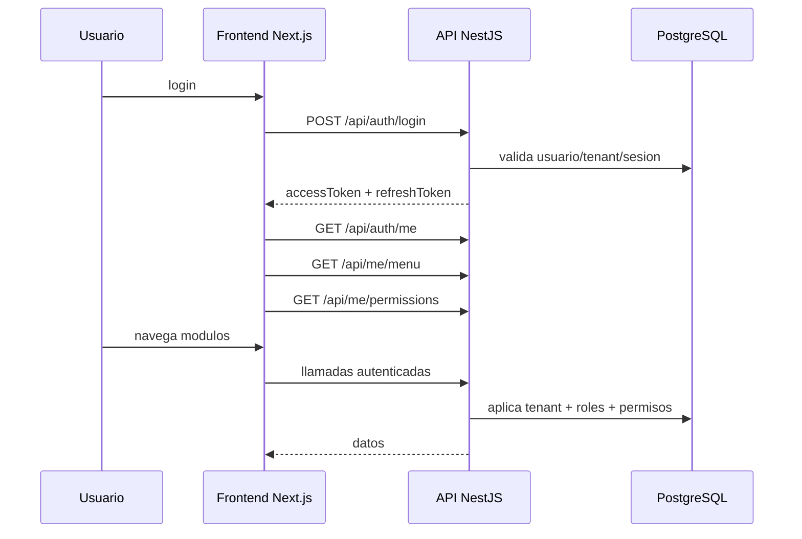

# Arquitectura general

## Vista general

El sistema esta separado en dos aplicaciones:

- `web/`: frontend Next.js App Router, con Redux global, layouts por tenant y POS responsive.
- `api/`: backend NestJS con modulos por dominio y acceso a PostgreSQL mediante `DatabaseService`.

## Flujo base

## Patrones observados

- Auth con JWT firmado y `session_id` obligatorio.
- Refresh tokens rotados y guardados en BD.
- Sesion de autenticacion unica por usuario/tenant en `auth_sessions`.
- Sesion POS separada en `pos_user_sessions`.
- Menu dinamico por tenant y rol.
- Permisos por `menu_items` + `role_menu_permissions`.
- Filtrado tenant/branch segun actor y contexto.
- Auditoria de eventos para configuracion, stock, compras, pedidos y ventas.

## Limites detectados

- No hay ORM; la capa SQL esta repartida entre repositorios y servicios.
- No existe un motor de migraciones automatizado.
- El DDL de inventario no esta completamente versionado en `database/`.
- No existe API REST documentada con OpenAPI/Swagger en el codigo actual.
