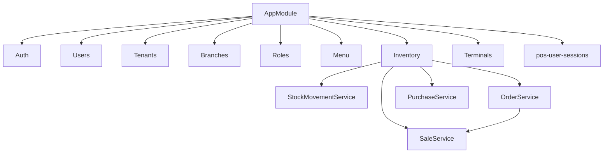

# Modulos y dependencias

## Grafo simplificado

## Dependencias relevantes

- `MenuService` depende de `CacheService` y BD.
- `PermissionsGuard` depende de `AccessControlService`.
- `JwtAuthGuard` depende de `auth_sessions`.
- `SaleService`, `OrderService` y `PurchaseService` dependen de `AuditService`.
- `PosUserSessionsService` enlaza `auth_sessions`, `terminals` y `pos_user_sessions`.
