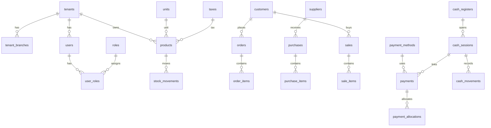

# Modelo de Datos

## Resumen

La base usa PostgreSQL y mezcla:

- esquema base inicial en `scripts/database/001_initial_schema.sql`
- extensiones de inventario y ventas en `scripts/database/products` y `scripts/database/sale`
- infraestructura financiera incremental en `scripts/database/finance`

El patrón dominante es:

- `tenant_id` como eje de aislamiento
- entidades maestras por tenant
- documentos operativos con estado
- trazabilidad por auditoría y sesiones

## Tablas clave

## Core SaaS

### `tenants`

Representa cada cliente SaaS.

Campos relevantes:

- `id`
- `slug`
- `nombre`
- `config`
- `activo`

Relaciones:

- 1:N con `users`
- 1:N con `tenant_branches`
- 1:N con datos operativos (`products`, `orders`, `purchases`, `sales`, `payments`, etc.)

### `tenant_branches`

Sucursales del tenant.

Campos relevantes:

- `tenant_id`
- `codigo`
- `nombre`
- `es_principal`
- `estado`
- ubicación y contacto

Relaciones:

- N:1 con `tenants`
- 1:N con cajas, terminales, compras, pagos y contexto operativo

Reglas:

- `UNIQUE (tenant_id, codigo)`
- una sola sucursal principal por tenant

### `personas`

Entidad de datos personales/organizacionales.

Campos relevantes:

- `tenant_id`
- nombres y apellidos
- documento
- teléfono, dirección
- datos de cargo/función

Relaciones:

- 1:1 opcional con `users`
- se reutiliza como base de clientes/proveedores/pagadores según módulo

### `users`

Usuarios autenticables.

Campos relevantes:

- `tenant_id`
- `persona_id`
- `email`
- `password_hash`
- `estado`

Relaciones:

- N:1 con `tenants`
- 1:N con `auth_sessions`
- N:M con `roles` vía `user_roles`

Reglas:

- `UNIQUE (tenant_id, email)`
- estados: `ACTIVE`, `INACTIVE`, `BLOCKED`

### `roles`

Catálogo global de roles.

Valores de negocio usados por el código:

- `SUPER_ADMIN`
- `SUPER_USER`
- `ADMIN`
- `USER`

### `user_roles`

Asignación de roles por usuario y tenant.

Clave primaria:

- `(user_id, role_id, tenant_id)`

## Seguridad y menú

### `menu_items`

Árbol de navegación y permisos funcionales.

### `role_menu_permissions`

Permisos efectivos por rol y menú dentro del tenant.

Campos clave:

- `access_level`: `READ` | `WRITE`
- `actions`: `jsonb`

## Operación POS y contexto

### `auth_sessions`

Sesiones activas de autenticación.

Uso:

- el JWT lleva `session_id`
- `GET /auth/me` valida que la sesión siga activa

### `auth_refresh_tokens`

Refresh tokens hasheados y rotables.

### `terminals`

Terminales operativas por sucursal.

### `pos_user_sessions`

Sesiones POS del usuario.

Uso:

- fijan `branchId`, `terminalId` y `posSessionId`
- sirven para contextualizar pedidos, ventas y movimientos de inventario

## Catálogo de inventory

### `units`

Unidades de medida por tenant.

### `taxes`

Impuestos por tenant.

### `products`

Productos inventariables.

Campos relevantes:

- `tenant_id`
- `unit_id`
- `tax_id`
- `name`
- `sku`
- `price`
- `cost`
- `price_with_tax`
- `price_without_tax`
- `is_active`

Relaciones:

- N:1 con `units`
- N:1 con `taxes`
- 1:N con `stock_movements`
- 1:N con `order_items`
- 1:N con `purchase_items`
- 1:N con `sale_items`

Reglas:

- `UNIQUE (tenant_id, sku)`

## Inventario físico y trazabilidad

### `stock_movements`

Registro fuente del movimiento de inventario.

Tipos observados:

- `IN`
- `OUT`

`reference_type` observados:

- `PURCHASE`
- `SALE`
- `ADJUSTMENT`

Contexto operativo adicional:

- `branch_id`
- `terminal_id`
- `pos_session_code`
- `user_id`

Regla de negocio:

- compras recibidas generan `IN`
- ventas generan `OUT`
- ajustes manuales generan entradas o salidas

## Pedidos

### `orders`

Documento comercial previo a facturación.

Campos relevantes:

- `tenant_id`
- `customer_id`
- `type`
- `status`
- `total`
- `payment_status`
- `total_paid`
- `balance_due`

Estados usados por código:

- `DRAFT`
- `CONFIRMED`
- `PARTIAL`
- `COMPLETED`
- `CANCELLED`

Relaciones:

- N:1 con `customers`
- 1:N con `order_items`
- 1:N lógica con `payments`/`payment_allocations` usando `reference_type = 'SALES_ORDER'`
- 1:N lógica con `sales` cuando se factura

### `order_items`

Detalle del pedido.

Responsabilidades:

- cantidad pedida
- cantidad entregada
- cantidad facturada
- precio/subtotal

## Compras

### `purchases`

Documento de abastecimiento.

Campos relevantes:

- `tenant_id`
- `supplier_id`
- `type`
- `status`
- `total`
- `balance`
- `total_paid`
- `balance_due`
- `payment_status`

Estados usados por código:

- `DRAFT`
- `PENDING`
- `PARTIAL`
- `RECEIVED`
- `CANCELLED`

Relaciones:

- N:1 con `suppliers`
- 1:N con `purchase_items`
- 1:N lógica con `payments`/`payment_allocations` usando `reference_type = 'PURCHASE'`

Reglas:

- el stock solo se afecta al recibir mercancía
- una compra `CREDIT` puede nacer con saldo y luego quedar `PAID`

### `purchase_items`

Detalle de compra.

Responsabilidades:

- cantidad ordenada
- cantidad recibida
- costo
- subtotal

## Ventas

### `sales`

Documento fiscal/comercial de venta.

Campos relevantes:

- `tenant_id`
- `customer_id`
- `order_id` opcional
- `type`
- `status`
- `total`
- `balance`
- `total_paid`
- `balance_due`
- `payment_status`

Estados usados por código:

- `DRAFT`
- `CONFIRMED`
- `CANCELLED`

Relaciones:

- N:1 con `customers`
- N:1 opcional con `orders`
- 1:N con `sale_items`
- 1:N lógica con `payments`/`payment_allocations` usando `reference_type = 'SALE'`

Reglas:

- ventas `CASH` deben quedar sin saldo
- ventas `CREDIT` pueden conservar saldo
- cancelar una venta requiere reversión funcional y de inventario

### `sale_items`

Detalle de productos vendidos.

### `sale_item_taxes`

Impuestos por línea de venta.

## Finanzas

### `payment_methods`

Catálogo de métodos de pago por tenant.

Tipos observados:

- `CASH`
- `CARD`
- `BANK`
- `DIGITAL`
- `CREDIT`

### `payments`

Registro financiero primario.

Campos relevantes:

- `tenant_id`
- `branch_id`
- `payment_method_id`
- `cash_session_id`
- `reference_type`
- `reference_id`
- `direction`
- `status`
- `amount`

`reference_type` soportados:

- `SALE`
- `PURCHASE`
- `SALES_ORDER`
- `PURCHASE_ORDER`
- `EXPENSE`
- `REFUND`
- `CUSTOMER_CREDIT`
- `SUPPLIER_CREDIT`

Reglas:

- si el pago es `CASH` y está `COMPLETED`, debe venir amarrado a `cash_session_id`
- el mismo pago puede distribuirse mediante asignaciones

### `payment_allocations`

Permite repartir un pago sobre documentos de negocio.

Campos relevantes:

- `payment_id`
- `reference_type`
- `reference_id`
- `allocated_amount`

Uso real:

- abonos a órdenes
- pagos a compras
- cobros de ventas
- herencia de abonos de order hacia sale al facturar

### `cash_registers`

Cajas físicas/operativas por sucursal y opcionalmente terminal.

### `cash_sessions`

Sesión operativa de una caja.

Estados usados:

- `OPEN`
- `CLOSED`
- `CANCELLED`

### `cash_movements`

Movimientos de caja.

Tipos observados:

- `OPENING`
- `CLOSING`
- `ADJUSTMENT`
- `EXPENSE`
- `WITHDRAWAL`
- `PAYMENT`

Reglas:

- apertura y cierre se generan automáticamente
- pagos completados asociados a caja generan `movement_type = 'PAYMENT'`
- gastos/retiros manuales usan `EXPENSE` y `WITHDRAWAL`

### `cash_counts`

Arqueos de caja agregados en la evolución reciente del módulo financiero.

## Relaciones clave

## Reglas de negocio críticas

- El aislamiento principal es por `tenant_id`.
- La sucursal delimita la operación diaria de `ADMIN` y `USER`.
- Compras afectan inventario al recibir, no al crear.
- Pedidos no afectan stock hasta su entrega.
- Ventas afectan inventario al confirmarse/crearse en el flujo POS.
- Los pagos se registran en `payments` y su impacto documental ocurre por `payment_allocations`.
- Caja y POS son contextos relacionados, pero no equivalentes.

## Estructura SQL documentada

Ubicación base: `scripts/database`

Tipos reales observados:

- esquema base: `001_initial_schema.sql`, `002_extensions.sql`
- seeds base: `003_*` a `010_*`
- migraciones por dominio:
  - `scripts/database/products`
  - `scripts/database/sale`
  - `scripts/database/finance/migrations`
- parches correctivos:
  - `scripts/database/finance/patches`
- scripts auxiliares:
  - `migrate.sh`
  - `rollback.sh`
  - `seed.sh`
  - `backup.sh`

## Observaciones PRD

- El modelo evolucionó por capas; algunas tablas base se amplían luego vía scripts de dominio.
- Para PRD conviene congelar un orden oficial de ejecución y registrar checksums por cambio.
- El dominio financiero ya es parte del modelo crítico y debe tratarse como first-class citizen en despliegues.
