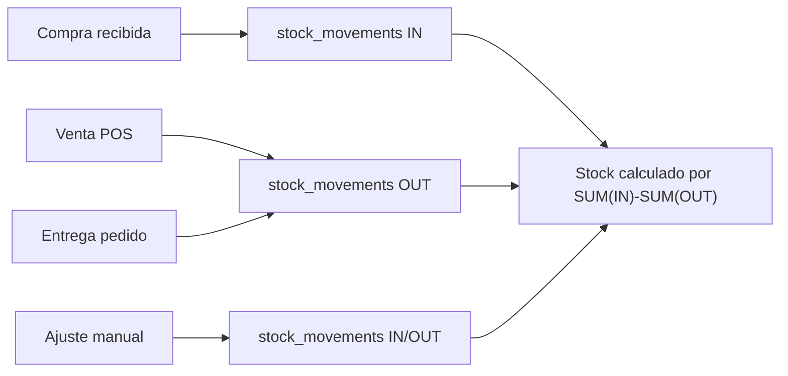
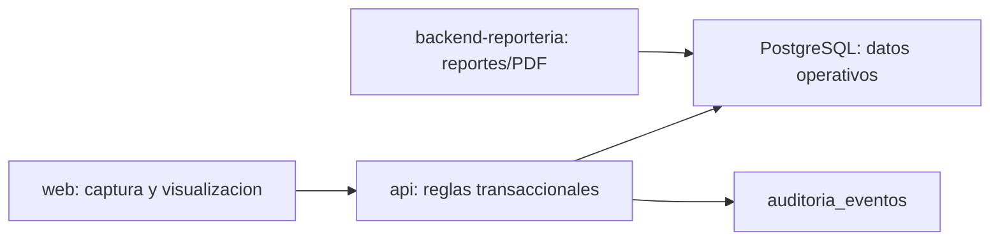

# Diseno: fortalecer productos e inventario

## Arquitectura actual observada

La arquitectura real tiene tres aplicaciones activas:

```text
web/                -> Next.js 14, React, Redux Toolkit, UI operativa
api/                -> NestJS transaccional, PostgreSQL directo con pg
backend-reporteria/ -> NestJS de reportes, funciones SQL y PDFs con pdfmake
```

El flujo actual de inventario:



El producto actual es basico: unidad, impuesto, SKU, precio, costo, estado activo. El stock se calcula desde `stock_movements` por `tenant_id`, `product_id` y `branch_id`.

Las ventas POS usan funciones SQL. Esto es bueno para atomicidad, pero aumenta el cuidado al evolucionar FEFO/lotes.

## Arquitectura propuesta

La arquitectura objetivo debe mantener la separacion actual:



### Principios de diseno

| Principio | Decision |
| --- | --- |
| Dueno transaccional | `api/` decide stock, lote, FEFO, precio y auditoria. |
| Reporteria separada | `backend-reporteria/` solo lee y genera JSON/PDF/exportables. |
| Compatibilidad | Productos sin lote siguen funcionando. |
| Multi-tenant | Toda tabla/consulta nueva debe filtrar `tenant_id`. |
| Sucursal | Stock operativo debe ser por sucursal cuando aplique. |
| POS ergonomico | FEFO automatico; el cajero ve alertas, no resuelve lotes. |
| Historico estable | Ventas pasadas mantienen precio vendido. |

## Separacion de responsabilidades

| Area | `api/` | `backend-reporteria/` | `web/` |
| --- | --- | --- | --- |
| Producto enriquecido | Valida y persiste configuracion. | Puede consultar catalogo enriquecido para reportes. | Formularios y badges. |
| Lotes/vencimientos | Crea, descuenta y audita lotes. | Reporta vencidos/proximos a vencer. | Captura en recepcion y muestra alertas. |
| FEFO | Decide lote de salida en transaccion. | Solo muestra trazabilidad. | No decide. |
| Precios | Cambia precio e historial. | Reporta historial. | Formulario cambio precio y visor historico. |
| Alertas | Calcula reglas operativas base. | Consolida/reporta. | Muestra badges, filtros y paneles. |
| Caja | Mantiene pagos y sesiones. | Reporta cierres/arqueos. | No mezcla reglas de lote con caja. |

## Modelo conceptual propuesto

No se crean nombres finales de tablas en esta fase. El modelo conceptual debe cubrir:

| Concepto | Campos minimos conceptuales |
| --- | --- |
| Producto enriquecido | perecedero, requiere lote, requiere vencimiento, barcode, estado operativo, clasificacion. |
| Lote | producto, tenant, lote/codigo, vencimiento, costo, proveedor/compra origen, estado. |
| Existencia por lote/sucursal | tenant, sucursal, producto, lote, cantidad disponible, cantidad reservada opcional. |
| Ubicacion fisica | tenant, sucursal, nombre/codigo, jerarquia opcional. |
| Movimiento con lote | movimiento actual + lote + ubicacion + cantidad. |
| Historial de precio | producto, precio anterior, precio nuevo, motivo, usuario, vigencia desde/hasta. |
| Alerta operativa | tipo, severidad, producto, lote, sucursal, fecha, estado. |

SUPUESTO: En Fase 2 se definiran nombres fisicos de tablas, indices y restricciones.

## Decisiones tecnicas recomendadas

### Productos

- Agregar metadata operativa sin romper `ProductResponse`.
- Mantener `sku` como identificador interno actual.
- Agregar barcode como campo separado si negocio lo requiere.
- Hacer campos nuevos opcionales durante migracion.
- Activar obligatoriedad de lote/vencimiento solo por configuracion de producto.

### Inventario y lotes

- Mantener `stock_movements` como ledger principal.
- Extender el ledger o relacionarlo con detalle de lote para no perder trazabilidad.
- Definir saldos por lote/sucursal para evitar calcular todo desde cero en cada venta.
- Permitir lote legacy para stock existente si se necesita migrar saldos.
- Bloquear ventas de lotes vencidos para productos perecederos.

### FEFO

- Resolver FEFO dentro de la transaccion de venta/entrega.
- Ordenar por fecha de vencimiento ascendente y luego por fecha de entrada.
- Excluir lotes vencidos salvo permiso/regla explicita futura.
- Mantener comportamiento actual para productos no loteados.

### Precios

- Mantener `products.price` como precio actual.
- Registrar cada cambio con motivo obligatorio, usuario, fecha y vigencia.
- No recalcular `sale_items.price` historico.
- Considerar validacion para evitar precios negativos o vigencias solapadas.

### Reporteria

- Crear funciones SQL nuevas para datasets de inventario.
- Crear adapters nuevos en `backend-reporteria/src/modules/reports/sql-adapters`.
- Crear services/controllers nuevos o secciones nuevas bajo `reports/inventory`.
- Reusar `PdfmakeEngine`, layouts A4 y `DataTable` en web.

### Frontend

- Reusar `ProductForm`, `PurchaseReceiveForm`, `InventoryDashboard`, `DataTable`, `ReportStatusBadge`, `NoticeDialog`.
- Usar badges claros para vencido, proximo a vencer, loteado, sin lote, stock bajo.
- En POS, mostrar advertencias utiles pero no pedir seleccion manual de lote por default.

## Alternativas evaluadas

| Alternativa | Ventaja | Desventaja | Recomendacion |
| --- | --- | --- | --- |
| Solo agregar columnas a `products` y `stock_movements` | Rapido. | No resuelve saldos por lote ni performance. | Insuficiente. |
| Crear sistema de lotes separado y mantener ledger | Trazable y compatible. | Mas trabajo. | Recomendada. |
| Resolver FEFO solo en frontend | Facil de mostrar. | Inseguro y rompe concurrencia. | Rechazada. |
| Resolver FEFO solo en reporteria | No toca POS. | No mueve stock real. | Rechazada. |
| Reemplazar todo inventario actual | Modelo limpio. | Alto riesgo para POS/compras. | Rechazada. |
| Implementacion incremental | Reduce riesgo. | Requiere fases y compatibilidad temporal. | Recomendada. |

## Riesgos y mitigaciones

| Riesgo | Mitigacion |
| --- | --- |
| Stock inconsistente entre lote y movimientos | Transacciones atomicas y pruebas de reconciliacion. |
| POS lento por FEFO | Indices por tenant/sucursal/producto/vencimiento y saldos por lote. |
| Productos historicos sin lote | Lote legacy o modo "sin lote requerido" transitorio. |
| Reportes actuales fallan | Mantener funciones existentes y crear nuevas funciones separadas. |
| Compras parciales | Crear lotes solo por cantidad recibida, no por cantidad pendiente/liquidada. |
| Ajustes sin trazabilidad | Crear documento/concepto de ajuste persistente en Fase 2/3. |
| Precios solapados | Restricciones o validacion de vigencia. |

## Consideraciones de compatibilidad

1. Los endpoints actuales deben seguir respondiendo campos actuales.
2. Campos nuevos en respuestas deben ser opcionales al inicio.
3. `ProductResponse` debe poder representar productos sin lote.
4. `sale_items` ya guarda precio de venta; no se debe recalcular historico.
5. `purchase_items` actuales no tienen lote; las compras anteriores deben seguir visibles.
6. `stock_movements` actuales sin lote deben seguir computando stock agregado.
7. Tickets actuales no deben exigir lote/vencimiento.
8. Nuevos reportes deben ser rutas nuevas para no romper reportes POS/compras/caja.

## Estrategia de migracion sin perdida de datos

| Paso | Objetivo |
| --- | --- |
| 1 | Congelar especificacion y acordar preguntas abiertas. |
| 2 | Crear modelo nuevo compatible con nulls y defaults. |
| 3 | Migrar productos existentes como no perecederos/no loteados por default. |
| 4 | Reconciliar stock actual desde `stock_movements` por tenant/sucursal/producto. |
| 5 | Crear registros legacy solo si se requiere lote para stock existente. |
| 6 | Activar captura de lotes en compras para productos configurados. |
| 7 | Activar FEFO en POS/pedidos para productos loteados. |
| 8 | Activar alertas y reportes. |
| 9 | Revisar performance y reconciliacion. |

SUPUESTO: Ninguna migracion destructiva debe ejecutarse sin respaldo y validacion de saldos.

PREGUNTA ABIERTA: La migracion de stock actual debe crear un lote legacy por producto/sucursal o dejar stock no loteado hasta agotar?

## Modelo de datos Fase 2

El diseno fisico propuesto queda documentado en `docs/modelo-datos-productos-inventario-fase-2.md`. Esta seccion resume las decisiones principales para mantener el cambio OpenSpec autocontenido.

### Objetivo del modelo

El modelo debe ser aditivo y compatible. `stock_movements` sigue siendo el ledger principal; las nuevas tablas de lotes, saldos, barcodes, ubicaciones, precios y alertas agregan trazabilidad y performance sin reemplazar el calculo historico actual.

### Tablas y extensiones propuestas

| Objeto | Decision |
| --- | --- |
| `products` | Agregar `is_perishable`, `requires_lot`, `requires_expiration`, `operational_status`, `rotation_class`, `min_stock`, `max_stock` con defaults seguros. |
| `product_barcodes` | Soportar multiples codigos por producto; `barcode` unico por `tenant_id`; un primario activo por producto. |
| `inventory_locations` | Catalogar ubicaciones fisicas por `tenant_id` y `branch_id`; codigo unico por sucursal. |
| `inventory_lots` | Registrar lote por producto/sucursal con proveedor, compra origen, vencimiento, costo unitario, estado e indicador legacy. |
| `inventory_lot_balances` | Mantener saldo operativo por lote/sucursal/ubicacion para FEFO y consultas rapidas. |
| `stock_movement_lots` | Relacionar `stock_movements` con lotes/ubicaciones afectados; permite trazabilidad y reversos. |
| `product_price_history` | Registrar precio anterior/nuevo, motivo obligatorio, usuario, vigencia y campos preparados para aprobacion futura. |
| `inventory_alert_rules` | Configurar alertas por tenant, incluyendo vencimiento default 30 dias y severidades `CRITICA`, `ALTA`, `PREVENTIVA`. |
| `inventory_alerts` | Persistir alertas detectadas por producto/lote/sucursal para dashboard y reporteria. |

### Tipos recomendados

| Uso | Tipo recomendado | Motivo |
| --- | --- | --- |
| Identificadores | `uuid` | Consistente con tablas actuales. |
| Dinero/costos | `numeric(14,2)` | Mas margen que `numeric(12,2)` actual sin perder precision. |
| Cantidades | `numeric(14,3)` | Permite unidades fraccionarias con mas precision operativa. |
| Fechas de vencimiento | `date` | El vencimiento no necesita hora. |
| Eventos/auditoria | `timestamptz` | Consistente con movimientos y created_at actuales. |
| Dominios simples | `text` con `CHECK` | Evita enums rigidos en una migracion temprana. |

### Reglas de compatibilidad

1. Productos existentes migran como no perecederos, no loteados y sin vencimiento obligatorio.
2. No se obliga lote a productos existentes hasta que un usuario/operacion lo active.
3. El stock agregado legacy sigue saliendo de `stock_movements`.
4. El lote legacy es opcional y solo se usara cuando se active control por lote sobre saldos existentes.
5. Las ventas historicas no se recalculan por cambios de precio.
6. Los reportes existentes no cambian contrato; reportes nuevos se agregan en `backend-reporteria`.

### FEFO y performance

FEFO debe resolverse dentro de la transaccion de venta, cancelacion o entrega. La consulta debe filtrar `tenant_id`, `branch_id`, `product_id`, saldo disponible y estado activo, luego ordenar por `expiration_date ASC NULLS LAST` y `received_at ASC`. Se recomiendan indices parciales sobre lotes activos con vencimiento y saldos con `quantity_available > 0`.

RIESGO: Resolver FEFO en frontend o fuera de transaccion puede permitir doble consumo concurrente.

### Reconciliacion

`inventory_lot_balances` es una proyeccion operativa. Debe poder reconciliarse contra `stock_movement_lots` y `stock_movements`:

| Control | Regla |
| --- | --- |
| Movimiento loteado | Todo movimiento nuevo de producto loteado debe tener detalle en `stock_movement_lots`. |
| Cantidad | La suma de detalles por lote debe igualar la cantidad del movimiento. |
| Saldo por lote | Entradas menos salidas por lote deben coincidir con `quantity_on_hand`. |
| Stock agregado | Saldos loteados mas stock legacy deben coincidir con el stock calculado desde `stock_movements`. |

### Rollback conceptual

El rollback conceptual consiste en desactivar reglas nuevas, ignorar tablas nuevas y volver a operar solo con `stock_movements` como fuente de stock agregado. No se recomienda eliminar tablas nuevas hasta respaldar datos, validar que no existen movimientos dependientes y confirmar que POS, compras y pedidos volvieron al flujo anterior.

PREGUNTA ABIERTA: Confirmar version de PostgreSQL para decidir si `quantity_available` puede ser generated column.

PREGUNTA ABIERTA: Confirmar si el stock legacy se consumira sin lote hasta agotarse o si se creara lote legacy al activar control por lote.

## Migracion SQL Fase 2.1

La preparacion fisica inicial queda en:

| Archivo | Proposito |
| --- | --- |
| `scripts/database/migrations/20260601_inventory_products_lots_phase_1.sql` | Crea columnas, tablas, constraints, FKs simples e indices preparatorios. |
| `scripts/database/migrations/20260601_inventory_products_lots_phase_1_rollback.sql` | Rollback conservador en orden inverso. |
| `docs/runbook-migracion-productos-inventario-fase-2-1.md` | Guia de validacion, backup, ejecucion futura y rollback. |

### Decisiones aplicadas

| Decision | Aplicacion |
| --- | --- |
| PostgreSQL 16 | `inventory_lot_balances.quantity_available` usa generated column stored. |
| FK tenant-aware gradual | Todas las tablas nuevas tienen `tenant_id`; se usan FKs simples iniciales y se documenta endurecimiento futuro con FKs compuestas. |
| Legacy sin lote | Productos existentes quedan con defaults `false`; no se crea lote legacy masivo. |
| Ubicacion opcional | `location_id` queda nullable y se usan dos unique indexes parciales para manejar null. |
| Alertas sin scheduler | Se crean tablas de reglas/alertas, pero no jobs ni seeds. |
| Compatibilidad POS | No se modifican `inventory_create_sale`, `inventory_invoice_order` ni flujos funcionales. |

### Notas de implementacion SQL

- Los scripts usan `ALTER TABLE ... ADD COLUMN IF NOT EXISTS`, `CREATE TABLE IF NOT EXISTS`, `CREATE INDEX IF NOT EXISTS` y bloques `DO $$` para constraints/FKs idempotentes.
- `products.min_stock` y `products.max_stock` usan `numeric(14,2)` segun decision de Fase 2.1.
- `rotation_class` usa `NO_MOVEMENT` como valor permitido.
- `product_barcodes.barcode_type` usa `UNIT`, `PACKAGE`, `BOX`, `SUPPLIER`, `INTERNAL`, `OTHER`.
- `inventory_alert_rules.severity` e `inventory_alerts.severity` usan `INFO`, `WARNING`, `HIGH`, `CRITICAL`.
- No se crea trigger global de `updated_at`; queda TODO hasta confirmar patron oficial.

RIESGO: Las FKs simples no impiden por si solas referencias cruzadas de tenant si una insercion futura trae datos inconsistentes. Fase 3 debe validar `tenant_id` y `branch_id` dentro de la transaccion.

RIESGO: El rollback elimina datos capturados en tablas nuevas. Debe ejecutarse solo antes de uso funcional real o despues de backup.
